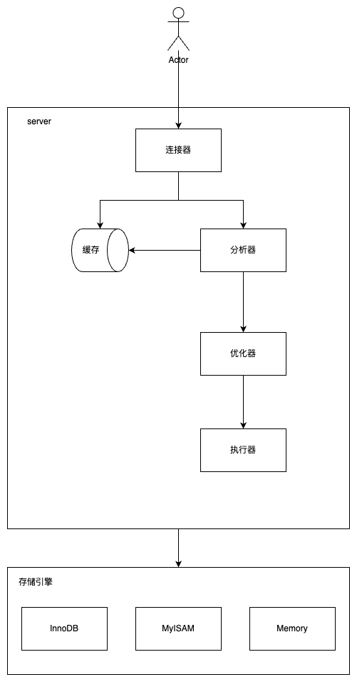

<!-- START doctoc generated TOC please keep comment here to allow auto update -->
<!-- DON'T EDIT THIS SECTION, INSTEAD RE-RUN doctoc TO UPDATE -->
**Table of Contents**  *generated with [DocToc](https://github.com/thlorenz/doctoc)*

- [基础架构](#%E5%9F%BA%E7%A1%80%E6%9E%B6%E6%9E%84)
  - [底层架构及每层作用](#%E5%BA%95%E5%B1%82%E6%9E%B6%E6%9E%84%E5%8F%8A%E6%AF%8F%E5%B1%82%E4%BD%9C%E7%94%A8)
  - [InnoDB和MylSAM存储引擎的区别？](#innodb%E5%92%8Cmylsam%E5%AD%98%E5%82%A8%E5%BC%95%E6%93%8E%E7%9A%84%E5%8C%BA%E5%88%AB)
  - [聚簇索引和非聚簇索引的区别？](#%E8%81%9A%E7%B0%87%E7%B4%A2%E5%BC%95%E5%92%8C%E9%9D%9E%E8%81%9A%E7%B0%87%E7%B4%A2%E5%BC%95%E7%9A%84%E5%8C%BA%E5%88%AB)
- [索引](#%E7%B4%A2%E5%BC%95)
  - [能简单说一下索引的分类吗？](#%E8%83%BD%E7%AE%80%E5%8D%95%E8%AF%B4%E4%B8%80%E4%B8%8B%E7%B4%A2%E5%BC%95%E7%9A%84%E5%88%86%E7%B1%BB%E5%90%97)
  - [为什么使用索引会加快查询？](#%E4%B8%BA%E4%BB%80%E4%B9%88%E4%BD%BF%E7%94%A8%E7%B4%A2%E5%BC%95%E4%BC%9A%E5%8A%A0%E5%BF%AB%E6%9F%A5%E8%AF%A2)
  - [创建索引有哪些注意点？](#%E5%88%9B%E5%BB%BA%E7%B4%A2%E5%BC%95%E6%9C%89%E5%93%AA%E4%BA%9B%E6%B3%A8%E6%84%8F%E7%82%B9)
  - [索引哪些情况下会失效呢？](#%E7%B4%A2%E5%BC%95%E5%93%AA%E4%BA%9B%E6%83%85%E5%86%B5%E4%B8%8B%E4%BC%9A%E5%A4%B1%E6%95%88%E5%91%A2)
  - [索引不适合哪些场景呢？](#%E7%B4%A2%E5%BC%95%E4%B8%8D%E9%80%82%E5%90%88%E5%93%AA%E4%BA%9B%E5%9C%BA%E6%99%AF%E5%91%A2)
  - [索引是不是建的越多越好呢？](#%E7%B4%A2%E5%BC%95%E6%98%AF%E4%B8%8D%E6%98%AF%E5%BB%BA%E7%9A%84%E8%B6%8A%E5%A4%9A%E8%B6%8A%E5%A5%BD%E5%91%A2)
  - [MySQL 索引用的什么数据结构了解吗？](#mysql-%E7%B4%A2%E5%BC%95%E7%94%A8%E7%9A%84%E4%BB%80%E4%B9%88%E6%95%B0%E6%8D%AE%E7%BB%93%E6%9E%84%E4%BA%86%E8%A7%A3%E5%90%97)
  - [MySQL索引底层实现为什么要用B+树结构？](#mysql%E7%B4%A2%E5%BC%95%E5%BA%95%E5%B1%82%E5%AE%9E%E7%8E%B0%E4%B8%BA%E4%BB%80%E4%B9%88%E8%A6%81%E7%94%A8b%E6%A0%91%E7%BB%93%E6%9E%84)
  - [Hash 索引和 B+ 树索引区别是什么？](#hash-%E7%B4%A2%E5%BC%95%E5%92%8C-b-%E6%A0%91%E7%B4%A2%E5%BC%95%E5%8C%BA%E5%88%AB%E6%98%AF%E4%BB%80%E4%B9%88)
  - [什么是最左前缀原则/最左匹配原则？](#%E4%BB%80%E4%B9%88%E6%98%AF%E6%9C%80%E5%B7%A6%E5%89%8D%E7%BC%80%E5%8E%9F%E5%88%99%E6%9C%80%E5%B7%A6%E5%8C%B9%E9%85%8D%E5%8E%9F%E5%88%99)
  - [什么是覆盖索引和回表查询？](#%E4%BB%80%E4%B9%88%E6%98%AF%E8%A6%86%E7%9B%96%E7%B4%A2%E5%BC%95%E5%92%8C%E5%9B%9E%E8%A1%A8%E6%9F%A5%E8%AF%A2)
- [日志](#%E6%97%A5%E5%BF%97)
  - [日志文件有哪些](#%E6%97%A5%E5%BF%97%E6%96%87%E4%BB%B6%E6%9C%89%E5%93%AA%E4%BA%9B)
  - [binlog 和 redolog 有什么区别？](#binlog-%E5%92%8C-redolog-%E6%9C%89%E4%BB%80%E4%B9%88%E5%8C%BA%E5%88%AB)
  - [一条更新语句怎么执行的了解吗？](#%E4%B8%80%E6%9D%A1%E6%9B%B4%E6%96%B0%E8%AF%AD%E5%8F%A5%E6%80%8E%E4%B9%88%E6%89%A7%E8%A1%8C%E7%9A%84%E4%BA%86%E8%A7%A3%E5%90%97)
  - [那为什么要两阶段提交呢？](#%E9%82%A3%E4%B8%BA%E4%BB%80%E4%B9%88%E8%A6%81%E4%B8%A4%E9%98%B6%E6%AE%B5%E6%8F%90%E4%BA%A4%E5%91%A2)
  - [redo log 怎么刷入磁盘的知道吗？](#redo-log-%E6%80%8E%E4%B9%88%E5%88%B7%E5%85%A5%E7%A3%81%E7%9B%98%E7%9A%84%E7%9F%A5%E9%81%93%E5%90%97)
- [SQL优化](#sql%E4%BC%98%E5%8C%96)
  - [慢SQL定位](#%E6%85%A2sql%E5%AE%9A%E4%BD%8D)
  - [有哪些方式优化慢 SQL？](#%E6%9C%89%E5%93%AA%E4%BA%9B%E6%96%B9%E5%BC%8F%E4%BC%98%E5%8C%96%E6%85%A2-sql)
  - [怎么看执行计划（explain），如何理解其中各个字段的含义？](#%E6%80%8E%E4%B9%88%E7%9C%8B%E6%89%A7%E8%A1%8C%E8%AE%A1%E5%88%92explain%E5%A6%82%E4%BD%95%E7%90%86%E8%A7%A3%E5%85%B6%E4%B8%AD%E5%90%84%E4%B8%AA%E5%AD%97%E6%AE%B5%E7%9A%84%E5%90%AB%E4%B9%89)
  - [精心总结MySQL开发16条规范](#%E7%B2%BE%E5%BF%83%E6%80%BB%E7%BB%93mysql%E5%BC%80%E5%8F%9116%E6%9D%A1%E8%A7%84%E8%8C%83)
  - [mysql优化思路](#mysql%E4%BC%98%E5%8C%96%E6%80%9D%E8%B7%AF)
- [锁](#%E9%94%81)
  - [MySQL锁的分类？](#mysql%E9%94%81%E7%9A%84%E5%88%86%E7%B1%BB)
  - [表锁加锁方式](#%E8%A1%A8%E9%94%81%E5%8A%A0%E9%94%81%E6%96%B9%E5%BC%8F)
  - [什么是共享锁（又称读锁、S锁）和排他锁（又称写锁、X锁）？](#%E4%BB%80%E4%B9%88%E6%98%AF%E5%85%B1%E4%BA%AB%E9%94%81%E5%8F%88%E7%A7%B0%E8%AF%BB%E9%94%81s%E9%94%81%E5%92%8C%E6%8E%92%E4%BB%96%E9%94%81%E5%8F%88%E7%A7%B0%E5%86%99%E9%94%81x%E9%94%81)
  - [什么是乐观锁和悲观锁？作用及实现方式？](#%E4%BB%80%E4%B9%88%E6%98%AF%E4%B9%90%E8%A7%82%E9%94%81%E5%92%8C%E6%82%B2%E8%A7%82%E9%94%81%E4%BD%9C%E7%94%A8%E5%8F%8A%E5%AE%9E%E7%8E%B0%E6%96%B9%E5%BC%8F)
  - [如何查看死锁日志，并手把手解决线上MySQL死锁问题？](#%E5%A6%82%E4%BD%95%E6%9F%A5%E7%9C%8B%E6%AD%BB%E9%94%81%E6%97%A5%E5%BF%97%E5%B9%B6%E6%89%8B%E6%8A%8A%E6%89%8B%E8%A7%A3%E5%86%B3%E7%BA%BF%E4%B8%8Amysql%E6%AD%BB%E9%94%81%E9%97%AE%E9%A2%98)
  - [事务](#%E4%BA%8B%E5%8A%A1)
  - [MySQL 事务的四大特性说一下？](#mysql-%E4%BA%8B%E5%8A%A1%E7%9A%84%E5%9B%9B%E5%A4%A7%E7%89%B9%E6%80%A7%E8%AF%B4%E4%B8%80%E4%B8%8B)
  - [那 ACID 靠什么保证的呢](#%E9%82%A3-acid-%E9%9D%A0%E4%BB%80%E4%B9%88%E4%BF%9D%E8%AF%81%E7%9A%84%E5%91%A2)
  - [什么是幻读，脏读，不可重复读呢？](#%E4%BB%80%E4%B9%88%E6%98%AF%E5%B9%BB%E8%AF%BB%E8%84%8F%E8%AF%BB%E4%B8%8D%E5%8F%AF%E9%87%8D%E5%A4%8D%E8%AF%BB%E5%91%A2)
  - [事务的隔离级别有哪些？MySQL 的默认隔离级别是什么？](#%E4%BA%8B%E5%8A%A1%E7%9A%84%E9%9A%94%E7%A6%BB%E7%BA%A7%E5%88%AB%E6%9C%89%E5%93%AA%E4%BA%9Bmysql-%E7%9A%84%E9%BB%98%E8%AE%A4%E9%9A%94%E7%A6%BB%E7%BA%A7%E5%88%AB%E6%98%AF%E4%BB%80%E4%B9%88)
  - [为什么互联网公司选择使用 RC，背后有什么思考吗？](#%E4%B8%BA%E4%BB%80%E4%B9%88%E4%BA%92%E8%81%94%E7%BD%91%E5%85%AC%E5%8F%B8%E9%80%89%E6%8B%A9%E4%BD%BF%E7%94%A8-rc%E8%83%8C%E5%90%8E%E6%9C%89%E4%BB%80%E4%B9%88%E6%80%9D%E8%80%83%E5%90%97)
  - [事务的各个隔离级别都是如何实现的？](#%E4%BA%8B%E5%8A%A1%E7%9A%84%E5%90%84%E4%B8%AA%E9%9A%94%E7%A6%BB%E7%BA%A7%E5%88%AB%E9%83%BD%E6%98%AF%E5%A6%82%E4%BD%95%E5%AE%9E%E7%8E%B0%E7%9A%84)
  - [MVCC 了解吗？怎么实现的？](#mvcc-%E4%BA%86%E8%A7%A3%E5%90%97%E6%80%8E%E4%B9%88%E5%AE%9E%E7%8E%B0%E7%9A%84)
  - [MySQL是如何解决幻读的？](#mysql%E6%98%AF%E5%A6%82%E4%BD%95%E8%A7%A3%E5%86%B3%E5%B9%BB%E8%AF%BB%E7%9A%84)
- [高可用/性能](#%E9%AB%98%E5%8F%AF%E7%94%A8%E6%80%A7%E8%83%BD)
  - [数据库读写分离了解吗](#%E6%95%B0%E6%8D%AE%E5%BA%93%E8%AF%BB%E5%86%99%E5%88%86%E7%A6%BB%E4%BA%86%E8%A7%A3%E5%90%97)
  - [主从复制原理了解吗？](#%E4%B8%BB%E4%BB%8E%E5%A4%8D%E5%88%B6%E5%8E%9F%E7%90%86%E4%BA%86%E8%A7%A3%E5%90%97)
  - [主从同步延迟怎么处理？](#%E4%B8%BB%E4%BB%8E%E5%90%8C%E6%AD%A5%E5%BB%B6%E8%BF%9F%E6%80%8E%E4%B9%88%E5%A4%84%E7%90%86)
  - [你们一般是怎么分库、分表的呢？](#%E4%BD%A0%E4%BB%AC%E4%B8%80%E8%88%AC%E6%98%AF%E6%80%8E%E4%B9%88%E5%88%86%E5%BA%93%E5%88%86%E8%A1%A8%E7%9A%84%E5%91%A2)
  - [不停机扩容怎么实现？](#%E4%B8%8D%E5%81%9C%E6%9C%BA%E6%89%A9%E5%AE%B9%E6%80%8E%E4%B9%88%E5%AE%9E%E7%8E%B0)
  - [那你觉得分库分表会带来什么问题呢](#%E9%82%A3%E4%BD%A0%E8%A7%89%E5%BE%97%E5%88%86%E5%BA%93%E5%88%86%E8%A1%A8%E4%BC%9A%E5%B8%A6%E6%9D%A5%E4%BB%80%E4%B9%88%E9%97%AE%E9%A2%98%E5%91%A2)
- [运维](#%E8%BF%90%E7%BB%B4)
  - [百万级别以上的数据如何删除](#%E7%99%BE%E4%B8%87%E7%BA%A7%E5%88%AB%E4%BB%A5%E4%B8%8A%E7%9A%84%E6%95%B0%E6%8D%AE%E5%A6%82%E4%BD%95%E5%88%A0%E9%99%A4)
  - [百万千万级大表如何添加字段](#%E7%99%BE%E4%B8%87%E5%8D%83%E4%B8%87%E7%BA%A7%E5%A4%A7%E8%A1%A8%E5%A6%82%E4%BD%95%E6%B7%BB%E5%8A%A0%E5%AD%97%E6%AE%B5)
  - [MySQL 数据库 cpu 飙升的话，要怎么处理呢？](#mysql-%E6%95%B0%E6%8D%AE%E5%BA%93-cpu-%E9%A3%99%E5%8D%87%E7%9A%84%E8%AF%9D%E8%A6%81%E6%80%8E%E4%B9%88%E5%A4%84%E7%90%86%E5%91%A2)
- [规范](#%E8%A7%84%E8%8C%83)
  - [数据库规范](#%E6%95%B0%E6%8D%AE%E5%BA%93%E8%A7%84%E8%8C%83)
  - [库](#%E5%BA%93)
  - [表](#%E8%A1%A8)
- [其他](#%E5%85%B6%E4%BB%96)
  - [什么是关系型数据库RDB](#%E4%BB%80%E4%B9%88%E6%98%AF%E5%85%B3%E7%B3%BB%E5%9E%8B%E6%95%B0%E6%8D%AE%E5%BA%93rdb)
  - [什么是内连接、外连接、交叉连接](#%E4%BB%80%E4%B9%88%E6%98%AF%E5%86%85%E8%BF%9E%E6%8E%A5%E5%A4%96%E8%BF%9E%E6%8E%A5%E4%BA%A4%E5%8F%89%E8%BF%9E%E6%8E%A5)
  - [MySQL 的内连接、左连接、右连接有有什么区别](#mysql-%E7%9A%84%E5%86%85%E8%BF%9E%E6%8E%A5%E5%B7%A6%E8%BF%9E%E6%8E%A5%E5%8F%B3%E8%BF%9E%E6%8E%A5%E6%9C%89%E6%9C%89%E4%BB%80%E4%B9%88%E5%8C%BA%E5%88%AB)
  - [说一下数据库的三大范式](#%E8%AF%B4%E4%B8%80%E4%B8%8B%E6%95%B0%E6%8D%AE%E5%BA%93%E7%9A%84%E4%B8%89%E5%A4%A7%E8%8C%83%E5%BC%8F)
  - [varchar 与 char 的区别](#varchar-%E4%B8%8E-char-%E7%9A%84%E5%8C%BA%E5%88%AB)
  - [drop、delete 与 truncate 的区别？](#dropdelete-%E4%B8%8E-truncate-%E7%9A%84%E5%8C%BA%E5%88%AB)
  - [UNION 与 UNION ALL 的区别？](#union-%E4%B8%8E-union-all-%E7%9A%84%E5%8C%BA%E5%88%AB)
  - [count(1)、count(*) 与 count(列名) 的区别？](#count1count-%E4%B8%8E-count%E5%88%97%E5%90%8D-%E7%9A%84%E5%8C%BA%E5%88%AB)
  - [一条 SQL 查询语句的执行顺序？](#%E4%B8%80%E6%9D%A1-sql-%E6%9F%A5%E8%AF%A2%E8%AF%AD%E5%8F%A5%E7%9A%84%E6%89%A7%E8%A1%8C%E9%A1%BA%E5%BA%8F)
  - [为什么不推荐使用 TEXT 和 BLOB](#%E4%B8%BA%E4%BB%80%E4%B9%88%E4%B8%8D%E6%8E%A8%E8%8D%90%E4%BD%BF%E7%94%A8-text-%E5%92%8C-blob)
  - [主从切换](#%E4%B8%BB%E4%BB%8E%E5%88%87%E6%8D%A2)

<!-- END doctoc generated TOC please keep comment here to allow auto update -->

# 基础架构

## 底层架构及每层作用



- 连接器：链接管理、权限校验
- 分析器：词法分析、语法分析
- 优化器：优化SQL生成执行计划
- 执行器：执行SQL接受结果

MySQL 架构可以分为 Server层 和 Engine层 

- Server（服务）层：涵盖了 MySQL 上层核心服务功能。包括 “连接器”、“查询缓存”、“分析器”、“优化器”、“执行器”、内置函数等等。
- Engine（引擎）层：主要负责数据的存储和提取等底层服务。其实现是插件式的，MySQL 支持 InnoDB、MyISAM、Memory 等多个存储引擎。目前，最常用的是 InnoDB 存储引擎。

## InnoDB和MylSAM存储引擎的区别？

```go
// 查看引擎
show engines
```

常见引擎的区别

- InnoDB：支持事务，支持行锁，支持外键。
- MyISAM：不支持事务，只支持表锁，不支持外键。
- Memory：所有数据置于内存的存储引擎，拥有极高的插入，更新和查询效率。但是会占用和数据量成正比的内存空间。并且其内容会在MySQL重新启动时丢失。

MySQL 5.5 之前，MyISAM 引擎是 MySQL 的默认存储引擎，MyISAM 的性能还行，各种特性也还不错，MyISAM 不支持事务和行级锁，而且最大的缺陷就是崩溃后无法安全恢复。

MySQL 5.5 版本之后，InnoDB 是 MySQL 的默认存储引擎。

## 聚簇索引和非聚簇索引的区别？

聚簇索引的叶子节点保存整行记录，非聚簇索引的叶子节点索引数据和主键ID。

# 索引

## 能简单说一下索引的分类吗？

- 主键索引: InnoDB 主键是默认的索引，数据列不允许重复，不允许为 NULL，一个表只能有一个主键。
- 唯一索引: 数据列不允许重复，允许为 NULL 值，一个表允许多个列创建唯一索引。
- 普通索引: 基本的索引类型，没有唯一性的限制，允许为 NULL 值。
- 组合索引：多列值组成一个索引，用于组合搜索，效率大于索引合并

## 为什么使用索引会加快查询？

传统的查询方法，是按照表的顺序遍历的，不论查询几条数据，MySQL 需要将表的数据从头到尾遍历一遍。

MySQL 一般通过 BTREE 算法生成一个索引文件，在查询数据库时，找到索引文件进行遍历，在比较小的索引数据里查找，然后映射到对应的数据，能大幅提升查找的效率。

## 创建索引有哪些注意点？

索引虽然是 sql 性能优化的利器，但是索引的维护也是需要成本的，所以创建索引，也要注意：

- 索引应该建在查询应用频繁的字段: 在用于 where 判断、 order 排序和 join 的(on)字段上创建索引。
- 索引的个数应该适量: 索引需要占用空间；更新时候也需要维护。
- 区分度低的字段，例如性别，不要建索引。
- 频繁更新的值，不要作为主键或者索引
- 创建组合索引，而不是修改单列索引。
- 组合索引把散列性高(区分度高)的值放在前面: 为了满足最左前缀匹配原则

## 索引哪些情况下会失效呢？

- 查询条件包含 or，可能导致索引失效
- 如果字段类型是字符串，where 时一定用引号括起来，否则会因为隐式类型转换，索引失效
- like 通配符可能导致索引失效。
- 联合索引，查询时的条件列不是联合索引中的第一个列，索引失效。
- 在索引列上使用 mysql 的内置函数，索引失效。
- 对索引列运算（如，+、-、*、/），索引失效。
- 索引字段上使用（！= 或者 < >，not in）时，可能会导致索引失效。
- 索引字段上使用 is null， is not null，可能导致索引失效。
- 左连接查询或者右连接查询查询关联的字段编码格式不一样，可能导致索引失效。
- MySQL 优化器估计使用全表扫描要比使用索引快,则不使用索引。

## 索引不适合哪些场景呢？

- 数据量比较少的表不适合加索引
- 更新比较频繁的字段也不适合加索引
- 离散低的字段不适合加索引（如性别）

## 索引是不是建的越多越好呢？

当然不是。

- 索引会占据磁盘空间
- 索引虽然会提高查询效率，但是会降低更新表的效率。

## MySQL 索引用的什么数据结构了解吗？

B+树：只有叶子节点才会存储数据，非叶子节点只存储键值。叶子节点之间使用双向指针连接，最底层的叶子节点形成了一个双向有序链表。

##  MySQL索引底层实现为什么要用B+树结构？

B树和B+树就是为了文件检索系统设计的，更适合做索引结构。

B+树的优点是：

1. 每个节点存储的元素更多，看起来比B树更矮胖，导致磁盘IO次数更少。
2. 非叶子节点不存储数据，只存储索引，叶子节点存储全部数据。 这样设计导致每次查找都会查到叶子节点，效率更稳定，便于做性能优化。
3. 叶子节点之间使用有序链表连接。 这样设计方便范围查找，只需要遍历链表中相邻元素即可，不再需要二次遍历二叉树。

## Hash 索引和 B+ 树索引区别是什么？

- Hash 索引在等值查询上比 B+ 树效率更高。
- B+ 树可以进行范围查询，Hash 索引不能。

## 什么是最左前缀原则/最左匹配原则？

最左前缀原则、最左匹配原则、最左前缀匹配原则这三个都是一个概念。

当我们在(age,name)上建立联合索引的时候，where条件中只有age可以用到索引，同时有age和name也可以用到索引。但是只有name的时候是无法用到索引的。

我们创建了一个组合索引，如 (a1,a2,a3)，相当于创建了（a1）、(a1,a2)和 (a1,a2,a3) 三个索引。

## 什么是覆盖索引和回表查询？

- 在使用非聚簇索引查询的时候，叶子节点中已经有了所需结果，无需再查询主键索引，这时候就是用到了覆盖索引。

- 二次查询主键索引的行为就是回表查询。

# 日志

## 日志文件有哪些

MySQL 日志文件有很多，包括 ：

- 错误日志（error log）：错误日志文件对 MySQL 的启动、运行、关闭过程进行了记录，能帮助定位 MySQL 问题。
- 慢查询日志（slow query log）：慢查询日志是用来记录执行时间超过 long_query_time 这个变量定义的时长的查询语句。通过慢查询日志，可以查找出哪些查询语句的执行效率很低，以便进行优化。
- 一般查询日志（general log）：一般查询日志记录了所有对 MySQL 数据库请求的信息，无论请求是否正确执行。
- 二进制日志（bin log）：关于二进制日志，它记录了数据库所有执行的 DDL 和 DML 语句（除了数据查询语句 select、show 等），以事件形式记录并保存在二进制文件中。

还有两个 InnoDB 存储引擎特有的日志文件：

- 重做日志（redo log）：重做日志至关重要，因为它们记录了对于 InnoDB 存储引擎的事务日志。
- 回滚日志（undo log）：回滚日志同样也是 InnoDB 引擎提供的日志，顾名思义，回滚日志的作用就是对数据进行回滚。

## binlog 和 redolog 有什么区别？

- 记录的内容不同，bin log 记录的是关于一个事务的具体操作内容，即该日志是逻辑日志。而 redo log 记录的是关于每个页（Page）的更改的物理情况。
- redo log 是循环写入和擦除，bin log 是追加写入，不会覆盖已经写的文件。

## 一条更新语句怎么执行的了解吗？

更新语句的执行是 Server 层和引擎层配合完成。连接器 -> 分析器 -> 优化器 -> 执行器   再到 存储引擎

## 那为什么要两阶段提交呢？

保证数据库状态原先数据库的状态和被恢复后的数据库的状态一致

我们可以假设不采用两阶段提交的方式，而是采用“单阶段”进行提交，即要么先写入 redo log，后写入 binlog；要么先写入 binlog，后写入 redo log。这两种方式的提交都会导致原先数据库的状态和被恢复后的数据库的状态不一致。

## redo log 怎么刷入磁盘的知道吗？

redo log 的写入不是直接落到磁盘，而是在内存中设置了一片称之为redo log buffer的连续内存空间，也就是redo 日志缓冲区。

# SQL优化

## 慢SQL定位

- 慢查询日志
- 服务监控

## 有哪些方式优化慢 SQL？

SQL 语句本身的优化，以及数据库设计的优化。

- 避免不必要的列
- 分页优化
- 索引优化
- 避免使用or、 != 、 <> 操作符
- 小表驱动大表

## 怎么看执行计划（explain），如何理解其中各个字段的含义？

```sql
explain select name from student
```

- id 列：MySQL 会为每个 select 语句分配一个唯一的 id 值

- select_type 列，查询的类型，根据关联、union、子查询等等分类，常见的查询类型有 SIMPLE、PRIMARY。

- table 列：表示 explain 的一行正在访问哪个表。

- type 列：最重要的列之一。表示关联类型或访问类型，即 MySQL 决定如何查找表中的行。性能从最优到最差分别为：system > const > eq_ref > ref > fulltext > ref_or_null > index_merge > unique_subquery > index_subquery > range > index > ALL

- possible_keys 列：显示查询可能使用哪些索引来查找，使用索引优化 sql 的时候比较重要。

- key 列：这一列显示 mysql 实际采用哪个索引来优化对该表的访问，判断索引是否失效的时候常用。

- key_len 列：显示了 MySQL 使用

- ref 列：ref 列展示的就是与索引列作等值匹配的值，常见的有：const（常量），func，NULL，字段名。

- rows 列：这也是一个重要的字段，MySQL 查询优化器根据统计信息，估算 SQL 要查到结果集需要扫描读取的数据行数，这个值非常直观显示 SQL 的效率好坏，原则上 rows 越少越好。

- Extra 列：显示不适合在其它列的额外信息，虽然叫额外，但是也有一些重要的信息：
  - Using index：表示 MySQL 将使用覆盖索引，以避免回表
  - Using where：表示会在存储引擎检索之后再进行过滤
  - Using temporary ：表示对查询结果排序时会使用一个临时表。

## 精心总结MySQL开发16条规范

- 禁止使用select *

- 用小表驱动大表

- join关联表不宜过多

- 禁止使用左模糊或者全模糊查询

- 索引访问类型至少达到range级别

- 更优雅的使用联合索引

- 注意避免深分页

- 单表字段不要超过30个

- 枚举字段不要使用字符类型

- 小数类型禁止使用float和double

- 所有字段必须设置默认值且不允许为null

- 必须创建主键，最好是有序数值类型

- 快速判断是否存在某条记录

- in条件中数量不宜过多

- 禁止创建预留字段

- 单表索引数不要超过5个

## mysql优化思路

**查询是否返回了不需要的数据**

- 只需要固定几条数据，但是没有加limit
- 只需要部分字段，但是仍然select *
- 重复访问相同数据，可以通过缓存优化
- 考虑表结构是否有问题

**一些特定类型查询的优化**：

对于子查询，尽可能拆分/写成join形式，除非使用explain确保其执行方式

In 比较慢 使用exists代替

```sql
select * from code_check_issue 
where file_issue_id in (select id from code_check_file_issue where check_id=1554455)
# exists
select * from code_check_issue
where exists(
  select * from code_check_file_issue where check_id=1554455 and                                 
  code_check_issue.file_issue_id=code_check_file_issue.id
)
```

**Count**

1. 几种count的效果：

- count(*)：直接统计行数（不管null还是非null）
- count(1)：遍历全表，每有一行就+1，因为1不可能是null，所以null和非null都返回
- count(主键)：遍历全表，解析每一行主键，判断不可能为空，每有一行就+1
- count(列)：逐行取值，判断是否为空，非null就+1

综合考虑，个人建议使用count(*)或count(1)

# 锁

## MySQL锁的分类？

按锁的粒度可分为：表锁、页面锁、行锁、记录锁、间隙锁、临键锁

按锁的属性可分为：共享锁、排它锁

按加锁机制可分为：乐观锁、悲观锁

## 表锁加锁方式

```sql
# 对user表加读锁
lock table user read;
# 同时对user表加读锁，对order表加写锁
lock tables user read, order write;
```

## 什么是共享锁（又称读锁、S锁）和排他锁（又称写锁、X锁）？

**共享锁（又称读锁、S锁）：**

作用：防止其他事务修改当前数据。

加锁方式：在select语句末尾加上**lock in share mode**关键字。

```sql
# 对id=1的用户加读锁
select * from user where id=1 lock in share mode;
```

**排他锁（又称写锁、X锁）：**

作用：防止其他事务读取或者更新当前数据。

**加锁方式：**在select语句末尾加上**for update**关键字。

```sql
# 对id=1的用户加写锁
select * from user where id=1 for update;
```

## 什么是乐观锁和悲观锁？作用及实现方式？

**乐观锁：**

总是假设别人不会修改当前数据，所以每次读取数据的时候都不会加锁，只是在更新数据的时候通过version判断别人是否修改过数据,使用乐观锁（CAS）实现的。

适用于读多写少的场景。

**悲观锁：**

总是假设别人会修改当前数据，所以每次读取的时候，总是加锁。

适用于写多读少的场景。

## 如何查看死锁日志，并手把手解决线上MySQL死锁问题？

```sql
show engine innodb status;
```

## 事务

## MySQL 事务的四大特性说一下？

MySQL 通过事务管理和持久性存储机制来确保 ACID（原子性、一致性、隔离性和持久性）。

- 原子性：事务作为一个整体被执行，包含在其中的对数据库的操作要么全部被执行，要么都不执行。

- 一致性：指在事务开始之前和事务结束以后，数据不会被破坏，假如 A 账户给 B 账户转 10 块钱，不管成功与否，A 和 B 的总金额是不变的。

- 隔离性：多个事务并发访问时，事务之间是相互隔离的，即一个事务不影响其它事务运行效果。简言之，就是事务之间是进水不犯河水的。

- 持久性：表示事务完成以后，该事务对数据库所作的操作更改，将持久地保存在数据库之中。

## 那 ACID 靠什么保证的呢

- 原子性（Atomicity）：undo log机制为 InnoDB 提供了一种在事务失败或被中断时恢复数据的手段，从而保证了事务的原子性。
- 一致性（Consistency）：
- 隔离性 (Isolation)：InnoDB 存储引擎使用 MVCC (多版本并发控制) 机制来处理并发事务，确保每个事务都有自己的数据版本。
- 持久性 (Durability)：InnoDB 首先会写入 redo log，并不会立即修改数据文件。这种写入方式被称为“write-ahead logging”（先写日志）。

## 什么是幻读，脏读，不可重复读呢？

- 幻读：事务 A 查询一个范围的结果集，另一个并发事务 B 往这个范围中插入 / 删除了数据，并静悄悄地提交，然后事务 A 再次查询相同的范围，两次读取得到的结果集不一样了
- 脏读：事务 A、B 交替执行，事务 A 读取到事务 B 未提交的数据
- 不可重复读：在一个事务范围内，两个相同的查询，读取同一条记录，却返回了不同的数据

## 事务的隔离级别有哪些？MySQL 的默认隔离级别是什么？

事务的四个隔离级别

- 读未提交（Read Uncommitted）:最低的隔离级别，允许读取尚未提交的数据变更，可能会导致脏读、幻读或不可重复读。
- 读已提交（Read Committed）: 允许读取并发事务已经提交的数据，可以阻止脏读，但是幻读或不可重复读仍有可能发生。
- 可重复读（Repeatable Read）: 对同一字段的多次读取结果都是一致的，除非数据是被本身事务自己所修改，可以阻止脏读和不可重复读，但幻读仍有可能发生。
- 串行化（Serializable）：最高的隔离级别，完全服从ACID的隔离级别。所有的事务依次逐个执行，这样事务之间就完全不可能产生干扰，也就是说，该级别可以防止脏读、不可重复读以及幻读。

```SQL
SELECT @@tx_isolation;
```

MySQL 默认的事务隔离级别是可重复读 (Repeatable Read)。

## 为什么互联网公司选择使用 RC，背后有什么思考吗？

一致性读，又称为快照读。快照即当前行数据之前的历史版本。快照读就是使用快照信息显示基于某个时间点的查询结果，而不考虑与此同时运行的其他事务所执行的更改。

在MySQL 中，只有READ COMMITTED 和 REPEATABLE READ这两种事务隔离级别才会使用一致性读。

在 RC 中，每次读取都会重新生成一个快照，总是读取行的最新版本。

在 RR 中，快照会在事务中第一次SELECT语句执行时生成，只有在本事务中对数据进行更改才会更新快照。

> 大厂为了提升并发度和降低死锁发生的概率，会把数据库的隔离级别从默认的 RR 调整成 RC。一般一个事务也不会查两次

## 事务的各个隔离级别都是如何实现的？

- 读未提交：采取的是读不加锁原理。
- 读取已提交&可重复读：读取已提交和可重复读级别利用了ReadView和MVCC，也就是每个事务只能读取它能看到的版本（ReadView）。
- 串行化：串行化的实现采用的是读写都加锁的原理。对于同一行事务，写会加写锁，读会加读锁。

## MVCC 了解吗？怎么实现的？

MVCC(Multi Version Concurrency Control)，中文名是多版本并发控制，简单来说就是通过维护数据历史版本，从而解决并发访问情况下的读一致性问题。

跟ETCD差不多

## MySQL是如何解决幻读的？

在当前读的情况下，是通过加锁来解决幻读。

在快照读的情况下，是通过MVCC来解决幻读。


# 高可用/性能

## 数据库读写分离了解吗

MySQL读写分离是指 写操作在主库上执行，而对于查询操作，可以在从库上执行。主要目的是分担主库的压力。

**读写分离最基本原则：**

- 对于延迟敏感业务必须在主库读取，或采取主从验证机制，可在从库读取
- 报表，统计类，查询可以通过从库读取

## 主从复制原理了解吗？

- master 数据写入，更新 binlog
- master 创建一个 dump 线程向 slave 推送 binlog
- slave 连接到 master 的时候，会创建一个 IO 线程接收 binlog，并记录到 relay log 日志中
- slave 再开启一个 sql 线程读取 relay log 事件并在 slave 执行，完成同步
- slave 记录自己的 binglog

## 主从同步延迟怎么处理？

主从同步延迟的原因:但是从服务器的里面读取 binlog 的线程仅有一个

- 当某个 SQL 在从服务器上执行的时间稍长
- 由于某个 SQL 要进行锁表就会导致，主服务器的 SQL 大量积压，未被同步到从服务器里。

这就导致了主从不一致， 也就是主从延迟。

**解决主从复制延迟有几种常见的方法**:

- 写操作后的读操作指定发给数据库主服务器 (延迟敏感业务从主库读取)
- 从库读失败后再读一次主库（二次读取）
- 关键业务读写操作全部指向主机，非关键业务采用读写分离

## 你们一般是怎么分库、分表的呢？

垂直分库：以表为依据，按照业务归属不同，将不同的表拆分到不同的库中。

水平分库：以字段为依据，按照一定策略（hash、range 等），将一个库中的数据拆分到多个库中。

> 按业务垂直分，按字段水平分

## 不停机扩容怎么实现？

不停机扩容，实操起来是个非常麻烦而且很有风险的操作，当然，面试回答起来就简单很多。

- 第一阶段：在线双写，查询走老库
- 第二阶段：新库补齐数据
- 第三阶段：在线双写，查询走新库
- 第四阶段：旧库下线

## 那你觉得分库分表会带来什么问题呢

事务的问题

- 使用关系型数据库，有很大一点在于它保证事务完整性。
- 而分库之后单机事务就用不上了，必须使用分布式事务来解决。

# 运维

## 百万级别以上的数据如何删除

关于索引：由于索引需要额外的维护成本，因为索引文件是单独存在的文件,所以当我们对数据的增加,修改,删除,都会产生额外的对索引文件的操作,这些操作需要消耗额外的 IO,会降低增/改/删的执行效率。

所以，在我们删除数据库百万级别数据的时候，查询 MySQL 官方手册得知删除数据的速度和创建的索引数量是成正比的。

大量数据需要删除的情况下：

- 所以我们想要删除百万数据的时候可以先删除索引
- 然后删除其中无用数据
- 删除完成后重新创建索引创建索引也非常快

## 百万千万级大表如何添加字段

当线上的数据库数据量到达几百万、上千万的时候，加一个字段就没那么简单，因为可能会长时间`锁表`。

常用的使用临时表。添加字段、复制旧表数据、删除旧表、重命名新表的名字为旧表。

> 所以，如果表的数据特别大，同时又要保证数据完整，最好停机操作。

## MySQL 数据库 cpu 飙升的话，要怎么处理呢？

- 检查进程。确定是 mysql 导致还是其他原因。
- 查看 session 情况，确定是不是有消耗资源的 sql 在运行。
- 进行相应的调整 (比如说加索引、改 sql、改内存参数)

# 规范

## 数据库规范

1. 【强制】使用小写，有助于提高打字速度，避免因大小写敏感而导致的错误。
2. 【强制】没有空格，使用下划线代替。
3. 【强制】名称中没有数字，只有英文字母。
4. 【强制】有效的可理解的名称。
5. 【强制】名称应该是自我解释的。
6. 【强制】名称不应超过 32 个字符。
7. 【强制】避免使用前缀。

## 库

1. 【强制】遵守以上全部一般命名规则。
2. 【强制】使用单数。
3. 【强制】库的名称格式：业务系统名称_子系统名。
4. 【强制】一般分库名称命名格式是库通配名_编号，编号从 0 开始递增，比如 northwind_001，以时间进行分库的名称格式是库通配名_时间。
5. 【强制】创建数据库时必须显式指定字符集，并且字符集只能是 utf8 或者 utf8mb4。

1. 创建数据库 SQL 举例：

```go
create database db_name default character set utf8;
```

## 表

1. 【强制】遵守以上全部一般命名规则。
2. 【强制】使用单数。
3. 【强制】相关模块的表名与表名之间尽量体现 join 的关系，如 user 表和 user_login 表。
4. 【强制】创建表时必须显式指定字符集为 utf8 或 utf8mb4。
5. 【强制】创建表时必须显式指定表存储引擎类型，如无特殊需求，一律为 InnoDB。当需要使用除 InnoDB/MyISAM/Memory 以外的存储引擎时，必须通过 DBA 审核才能在生产环境中使用。因为 InnoDB 表支持事务、行锁、宕机恢复、MVCC 等关系型数据库重要特性，为业界使用最多的 MySQL 存储引擎。而这是其它大多数存储引擎不具备的，因此首推 InnoDB。
6. 【强制】建表必须有 comment。
7. 【强制】关于主键：

- 命名为 id，类型为 int 或 bigint，且为 auto_increment，初始值要为1；
- 标识表里每一行主体的字段不要设为主键，建议设为其它字段如 user_id，order_id等，并建立 unique key 索引。因为如果设为主键且主键值为随机插入，则会导致 InnoDB 内部 page 分裂和大量随机 I/O，性能下降。

1. 【建议】核心表（如用户表，金钱相关的表）必须有行数据的创建时间字段 create_time 和最后更新时间字段 update_time，便于排查问题。
2. 【建议】表中所有字段必须都是 NOT NULL 属性，业务可以根据需要定义 DEFAULT 值。因为使用 NULL 值会存在每一行都会占用额外存储空间、数据迁移容易出错、聚合函数计算结果偏差等问题。
3. 【建议】建议对表里的 blob、text 等大字段，垂直拆分到其它表里，仅在需要读这些对象的时候才去 select。
4. 【建议】反范式设计：把经常需要 join 查询的字段，在其它表里冗余一份。如 username 属性在 user_account，user_login_log 等表里冗余一份，减少 join 查询。
5. 【强制】中间表用于保留中间结果集，名称必须以 tmp_ 开头。备份表用于备份或抓取源表快照，名称必须以 bak_ 开头。中间表和备份表定期清理。
6. 【强制】对于超过 100W 行的大表进行 alter table，必须经过 DBA 审核，并在业务低峰期执行。因为 alter table 会产生表锁，期间阻塞对于该表的所有写入，对于业务可能会产生极大影响。

# 其他

## 什么是关系型数据库RDB

关系型数据库（RDB，Relational Database）就是一种建立在关系模型的基础上的数据库。关系模型表明了数据库中所存储的数据之间的联系（一对一、一对多、多对多）。

## 什么是内连接、外连接、交叉连接

- 内连接（inner join）：取得两张表中满足存在连接匹配关系的记录。
- 外连接（outer join）：不只取得两张表中满足存在连接匹配关系的记录，还包括某张表（或两张表）中不满足匹配关系的记录。
- 交叉连接（cross join）：显示两张表所有记录一一对应，没有匹配关系进行筛选，它是笛卡尔积在 SQL 中的实现，如果 A 表有 m 行，B 表有 n 行，那么 A 和 B 交叉连接的结果就有 m*n 行。

## MySQL 的内连接、左连接、右连接有有什么区别

MySQL 的连接主要分为内连接和外连接，外连接常用的有左连接、右连接。

- inner join 内连接，在两张表进行连接查询时，只保留两张表中完全匹配的结果集
- left join 在两张表进行连接查询时，会返回左表所有的行，即使在右表中没有匹配的记录。
- right join 在两张表进行连接查询时，会返回右表所有的行，即使在左表中没有匹配的记录。

## 说一下数据库的三大范式

- 第一范式：数据表中的每一列（每个字段）都不可以再拆分。例如用户表，用户地址还可以拆分成国家、省份、市，这样才是符合第一范式的。
- 第二范式：在第一范式的基础上，非主键列完全依赖于主键，而不能是依赖于主键的一部分。例如订单表里，存储了商品信息（商品价格、商品类型），那就需要把商品 ID 和订单 ID 作为联合主键，才满足第二范式。
- 第三范式：在满足第二范式的基础上，表中的非主键只依赖于主键，而不依赖于其他非主键。例如订单表，就不能存储用户信息（姓名、地址）。

三大范式的作用是为了控制数据库的冗余，是对空间的节省，实际上，一般互联网公司的设计都是反范式的，通过冗余一些数据，避免跨表跨库，利用空间换时间，提高性能。

## varchar 与 char 的区别

**char**：

- char 表示定长字符串，长度是固定的；
- 如果插入数据的长度小于 char 的固定长度时，则用空格填充；
- 因为长度固定，所以存取速度要比 varchar 快很多，甚至能快 50%，但正因为其长度固定，所以会占据多余的空间，是空间换时间的做法；
- 对于 char 来说，最多能存放的字符个数为 255，和编码无关

**varchar**：

- varchar 表示可变长字符串，长度是可变的；
- 插入的数据是多长，就按照多长来存储；
- varchar 在存取方面与 char 相反，它存取慢，因为长度不固定，但正因如此，不占据多余的空间，是时间换空间的做法；
- 对于 varchar 来说，最多能存放的字符个数为 65532

日常的设计，对于长度相对固定的字符串，可以使用 char，对于长度不确定的，使用 varchar 更合适一些。

## drop、delete 与 truncate 的区别？

在不再需要一张表的时候，用 drop；在想删除部分数据行时候，用 delete；在保留表而删除所有数据的时候用 truncate。

## UNION 与 UNION ALL 的区别？

如果使用 UNION，会在表链接后筛选掉重复的记录行

如果使用 UNION ALL，不会合并重复的记录行

从效率上说，UNION ALL 要比 UNION 快很多，如果合并没有刻意要删除重复行，那么就使用 UNION All

## count(1)、count(*) 与 count(列名) 的区别？

- count(*)包括了所有的列，相当于行数，在统计结果的时候，不会忽略列值为 NULL
- count(1)包括了忽略所有列，用 1 代表代码行，在统计结果的时候，不会忽略列值为 NULL
- count(列名)只包括列名那一列，在统计结果的时候，会忽略列值为空（这里的空不是只空字符串或者 0，而是表示 null）的计数，即某个字段值为 NULL 时，不统计。

## 一条 SQL 查询语句的执行顺序？

- FROM：对 FROM 子句中的左表<left_table>和右表<right_table>执行笛卡儿积（Cartesianproduct），产生虚拟表 VT1

- ON：对虚拟表 VT1 应用 ON 筛选，只有那些符合<join_condition>的行才被插入虚拟表 VT2 中

- JOIN：如果指定了 OUTER JOIN（如 LEFT OUTER JOIN、RIGHT OUTER JOIN），那么保留表中未匹配的行作为外部行添加到虚拟表 VT2 中，产生虚拟表 VT3。如果 FROM 子句包含两个以上表，则对上一个连接生成的结果表 VT3 和下一个表重复执行步骤 1）～步骤 3），直到处理完所有的表为止

- WHERE：对虚拟表 VT3 应用 WHERE 过滤条件，只有符合<where_condition>的记录才被插入虚拟表 VT4 中

- GROUP BY：根据 GROUP BY 子句中的列，对 VT4 中的记录进行分组操作，产生 VT5

- CUBE|ROLLUP：对表 VT5 进行 CUBE 或 ROLLUP 操作，产生表 VT6

- HAVING：对虚拟表 VT6 应用 HAVING 过滤器，只有符合<having_condition>的记录才被插入虚拟表 VT7 中。

- SELECT：第二次执行 SELECT 操作，选择指定的列，插入到虚拟表 VT8 中

- DISTINCT：去除重复数据，产生虚拟表 VT9

- ORDER BY：将虚拟表 VT9 中的记录按照<order_by_list>进行排序操作，产生虚拟表 VT10。11）

- LIMIT：取出指定行的记录，产生虚拟表 VT11，并返回给查询用户

## 为什么不推荐使用 TEXT 和 BLOB

- TEXT 类型类似于 CHAR（0-255 字节）和 VARCHAR（0-65,535 字节），但可以存储更长的字符串，即长文本数据。
- BLOB 类型主要用于存储二进制大对象，例如图片、音视频等文件。一般存文件路径

## 主从切换

1. 查询 slave 的 seconds_behind_master，如果小于预定的某个值（比如3秒），就下一步。

1. 否则就一直轮训，直到出现满足条件的Slave。（选未来主库）

1. 将 master 的 readonly = true，降为从库。
2. 等到 slave（未来主库） 的 seconds_behind_master 值变成 0。（即无主从延迟）
3. 将该 slave （未来主库）的状态变成读写。readonly = false，升成主库。
4. 将请求流量切到新主库。
