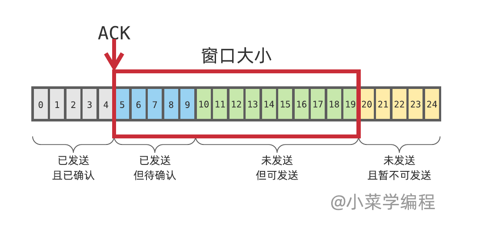
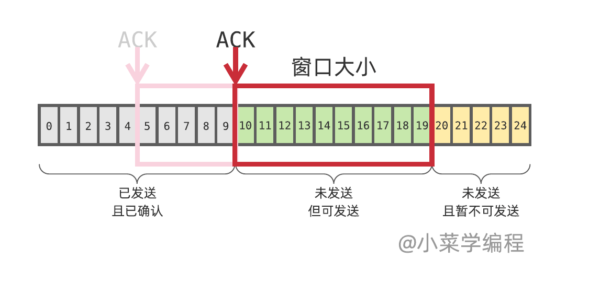

<!-- START doctoc generated TOC please keep comment here to allow auto update -->
<!-- DON'T EDIT THIS SECTION, INSTEAD RE-RUN doctoc TO UPDATE -->
**Table of Contents**  *generated with [DocToc](https://github.com/thlorenz/doctoc)*

- [自我介绍](#%E8%87%AA%E6%88%91%E4%BB%8B%E7%BB%8D)
- [项目中遇到的困难或者亮点](#%E9%A1%B9%E7%9B%AE%E4%B8%AD%E9%81%87%E5%88%B0%E7%9A%84%E5%9B%B0%E9%9A%BE%E6%88%96%E8%80%85%E4%BA%AE%E7%82%B9)
- [反问](#%E5%8F%8D%E9%97%AE)
- [HTTP和HTTPS的区别](#http%E5%92%8Chttps%E7%9A%84%E5%8C%BA%E5%88%AB)
- [HTTPS 是怎么保证安全性的呢？](#https-%E6%98%AF%E6%80%8E%E4%B9%88%E4%BF%9D%E8%AF%81%E5%AE%89%E5%85%A8%E6%80%A7%E7%9A%84%E5%91%A2)
- [:point_right:https请求过程](#point_righthttps%E8%AF%B7%E6%B1%82%E8%BF%87%E7%A8%8B)
- [HTTP2 相对于 HTTP1.1 有什么新的特性呢？](#http2-%E7%9B%B8%E5%AF%B9%E4%BA%8E-http11-%E6%9C%89%E4%BB%80%E4%B9%88%E6%96%B0%E7%9A%84%E7%89%B9%E6%80%A7%E5%91%A2)
- [:point_right:HTTPS的四次握手过程，期间都交换了什么信息](#point_righthttps%E7%9A%84%E5%9B%9B%E6%AC%A1%E6%8F%A1%E6%89%8B%E8%BF%87%E7%A8%8B%E6%9C%9F%E9%97%B4%E9%83%BD%E4%BA%A4%E6%8D%A2%E4%BA%86%E4%BB%80%E4%B9%88%E4%BF%A1%E6%81%AF)
- [HTTPS 包抓包是否了解？](#https-%E5%8C%85%E6%8A%93%E5%8C%85%E6%98%AF%E5%90%A6%E4%BA%86%E8%A7%A3)
- [HTTP(S)缓存机制是什么样子的呢？](#https%E7%BC%93%E5%AD%98%E6%9C%BA%E5%88%B6%E6%98%AF%E4%BB%80%E4%B9%88%E6%A0%B7%E5%AD%90%E7%9A%84%E5%91%A2)
- [HTTP 流量的录制工具主要是做什么用呢？](#http-%E6%B5%81%E9%87%8F%E7%9A%84%E5%BD%95%E5%88%B6%E5%B7%A5%E5%85%B7%E4%B8%BB%E8%A6%81%E6%98%AF%E5%81%9A%E4%BB%80%E4%B9%88%E7%94%A8%E5%91%A2)
- [HTTP 流量录制会涉及到一些登陆态的处理吗？](#http-%E6%B5%81%E9%87%8F%E5%BD%95%E5%88%B6%E4%BC%9A%E6%B6%89%E5%8F%8A%E5%88%B0%E4%B8%80%E4%BA%9B%E7%99%BB%E9%99%86%E6%80%81%E7%9A%84%E5%A4%84%E7%90%86%E5%90%97)
- [浏览器输入 URL 后回车发生了什么？](#%E6%B5%8F%E8%A7%88%E5%99%A8%E8%BE%93%E5%85%A5-url-%E5%90%8E%E5%9B%9E%E8%BD%A6%E5%8F%91%E7%94%9F%E4%BA%86%E4%BB%80%E4%B9%88)
- [DNS 是否了解？](#dns-%E6%98%AF%E5%90%A6%E4%BA%86%E8%A7%A3)
- [SSL/TLS对应OSI哪一层](#ssltls%E5%AF%B9%E5%BA%94osi%E5%93%AA%E4%B8%80%E5%B1%82)
- [:point_right:什么是短链(服务)，短链服务是否能被缓存？](#point_right%E4%BB%80%E4%B9%88%E6%98%AF%E7%9F%AD%E9%93%BE%E6%9C%8D%E5%8A%A1%E7%9F%AD%E9%93%BE%E6%9C%8D%E5%8A%A1%E6%98%AF%E5%90%A6%E8%83%BD%E8%A2%AB%E7%BC%93%E5%AD%98)
- [:point_right:TCP滑动窗口和滑动时间窗口限流](#point_righttcp%E6%BB%91%E5%8A%A8%E7%AA%97%E5%8F%A3%E5%92%8C%E6%BB%91%E5%8A%A8%E6%97%B6%E9%97%B4%E7%AA%97%E5%8F%A3%E9%99%90%E6%B5%81)
- [TCP的流量控制](#tcp%E7%9A%84%E6%B5%81%E9%87%8F%E6%8E%A7%E5%88%B6)
- [:point_right:TCP延迟确认](#point_righttcp%E5%BB%B6%E8%BF%9F%E7%A1%AE%E8%AE%A4)
- [TCP发送报文的过程](#tcp%E5%8F%91%E9%80%81%E6%8A%A5%E6%96%87%E7%9A%84%E8%BF%87%E7%A8%8B)
- [查看 TCP 连接状态需要用什么命令？](#%E6%9F%A5%E7%9C%8B-tcp-%E8%BF%9E%E6%8E%A5%E7%8A%B6%E6%80%81%E9%9C%80%E8%A6%81%E7%94%A8%E4%BB%80%E4%B9%88%E5%91%BD%E4%BB%A4)
- [TIME_WAIT 状态出现 TCP 的哪个阶段？](#time_wait-%E7%8A%B6%E6%80%81%E5%87%BA%E7%8E%B0-tcp-%E7%9A%84%E5%93%AA%E4%B8%AA%E9%98%B6%E6%AE%B5)
- [发现存在大量 TIME_WAIT 状态会存在什么问题？](#%E5%8F%91%E7%8E%B0%E5%AD%98%E5%9C%A8%E5%A4%A7%E9%87%8F-time_wait-%E7%8A%B6%E6%80%81%E4%BC%9A%E5%AD%98%E5%9C%A8%E4%BB%80%E4%B9%88%E9%97%AE%E9%A2%98)
- [:point_right:出现大量 TIME_WAIT 的话应用层有什么优化方案？](#point_right%E5%87%BA%E7%8E%B0%E5%A4%A7%E9%87%8F-time_wait-%E7%9A%84%E8%AF%9D%E5%BA%94%E7%94%A8%E5%B1%82%E6%9C%89%E4%BB%80%E4%B9%88%E4%BC%98%E5%8C%96%E6%96%B9%E6%A1%88)
- [:point_right:了解 TCP 中的粘包现象吗？](#point_right%E4%BA%86%E8%A7%A3-tcp-%E4%B8%AD%E7%9A%84%E7%B2%98%E5%8C%85%E7%8E%B0%E8%B1%A1%E5%90%97)
- [:point_right:如果有一个请求需要发送数据，但是我想把包拆分开（不等待），在应用层应该怎么做？](#point_right%E5%A6%82%E6%9E%9C%E6%9C%89%E4%B8%80%E4%B8%AA%E8%AF%B7%E6%B1%82%E9%9C%80%E8%A6%81%E5%8F%91%E9%80%81%E6%95%B0%E6%8D%AE%E4%BD%86%E6%98%AF%E6%88%91%E6%83%B3%E6%8A%8A%E5%8C%85%E6%8B%86%E5%88%86%E5%BC%80%E4%B8%8D%E7%AD%89%E5%BE%85%E5%9C%A8%E5%BA%94%E7%94%A8%E5%B1%82%E5%BA%94%E8%AF%A5%E6%80%8E%E4%B9%88%E5%81%9A)
- [TCP最后一个ack没有发送成功，会出现什么](#tcp%E6%9C%80%E5%90%8E%E4%B8%80%E4%B8%AAack%E6%B2%A1%E6%9C%89%E5%8F%91%E9%80%81%E6%88%90%E5%8A%9F%E4%BC%9A%E5%87%BA%E7%8E%B0%E4%BB%80%E4%B9%88)
- [如何防止泛洪攻击](#%E5%A6%82%E4%BD%95%E9%98%B2%E6%AD%A2%E6%B3%9B%E6%B4%AA%E6%94%BB%E5%87%BB)
- [ping用到哪些协议](#ping%E7%94%A8%E5%88%B0%E5%93%AA%E4%BA%9B%E5%8D%8F%E8%AE%AE)
- [:point_right:对称加密与非对称加密](#point_right%E5%AF%B9%E7%A7%B0%E5%8A%A0%E5%AF%86%E4%B8%8E%E9%9D%9E%E5%AF%B9%E7%A7%B0%E5%8A%A0%E5%AF%86)
- [什么是哈希函数？哈希函数有什么特性？](#%E4%BB%80%E4%B9%88%E6%98%AF%E5%93%88%E5%B8%8C%E5%87%BD%E6%95%B0%E5%93%88%E5%B8%8C%E5%87%BD%E6%95%B0%E6%9C%89%E4%BB%80%E4%B9%88%E7%89%B9%E6%80%A7)
- [连接池的中心思想是什么？主要解决的是什么问题？](#%E8%BF%9E%E6%8E%A5%E6%B1%A0%E7%9A%84%E4%B8%AD%E5%BF%83%E6%80%9D%E6%83%B3%E6%98%AF%E4%BB%80%E4%B9%88%E4%B8%BB%E8%A6%81%E8%A7%A3%E5%86%B3%E7%9A%84%E6%98%AF%E4%BB%80%E4%B9%88%E9%97%AE%E9%A2%98)
- [闭包有什么用？](#%E9%97%AD%E5%8C%85%E6%9C%89%E4%BB%80%E4%B9%88%E7%94%A8)
- [唯一ID怎么生成的？](#%E5%94%AF%E4%B8%80id%E6%80%8E%E4%B9%88%E7%94%9F%E6%88%90%E7%9A%84)
- [select和epoll各自优缺点](#select%E5%92%8Cepoll%E5%90%84%E8%87%AA%E4%BC%98%E7%BC%BA%E7%82%B9)
- [路由转发时目的地址和源地址的变化](#%E8%B7%AF%E7%94%B1%E8%BD%AC%E5%8F%91%E6%97%B6%E7%9B%AE%E7%9A%84%E5%9C%B0%E5%9D%80%E5%92%8C%E6%BA%90%E5%9C%B0%E5%9D%80%E7%9A%84%E5%8F%98%E5%8C%96)
- [防抖节流原理及应用场景](#%E9%98%B2%E6%8A%96%E8%8A%82%E6%B5%81%E5%8E%9F%E7%90%86%E5%8F%8A%E5%BA%94%E7%94%A8%E5%9C%BA%E6%99%AF)
- [线程和协程有什么区别呢？](#%E7%BA%BF%E7%A8%8B%E5%92%8C%E5%8D%8F%E7%A8%8B%E6%9C%89%E4%BB%80%E4%B9%88%E5%8C%BA%E5%88%AB%E5%91%A2)
- [多线程编程中线程安全怎么来保证呢？](#%E5%A4%9A%E7%BA%BF%E7%A8%8B%E7%BC%96%E7%A8%8B%E4%B8%AD%E7%BA%BF%E7%A8%8B%E5%AE%89%E5%85%A8%E6%80%8E%E4%B9%88%E6%9D%A5%E4%BF%9D%E8%AF%81%E5%91%A2)
- [乐观锁和悲观锁应用场景是什么？](#%E4%B9%90%E8%A7%82%E9%94%81%E5%92%8C%E6%82%B2%E8%A7%82%E9%94%81%E5%BA%94%E7%94%A8%E5%9C%BA%E6%99%AF%E6%98%AF%E4%BB%80%E4%B9%88)
- [进程间通讯的方式有哪些](#%E8%BF%9B%E7%A8%8B%E9%97%B4%E9%80%9A%E8%AE%AF%E7%9A%84%E6%96%B9%E5%BC%8F%E6%9C%89%E5%93%AA%E4%BA%9B)
- [内存泄漏怎么排查](#%E5%86%85%E5%AD%98%E6%B3%84%E6%BC%8F%E6%80%8E%E4%B9%88%E6%8E%92%E6%9F%A5)
- [MySQL存储引擎间区别](#mysql%E5%AD%98%E5%82%A8%E5%BC%95%E6%93%8E%E9%97%B4%E5%8C%BA%E5%88%AB)
- [SQL慢查询优化](#sql%E6%85%A2%E6%9F%A5%E8%AF%A2%E4%BC%98%E5%8C%96)
- [什么是回表查询](#%E4%BB%80%E4%B9%88%E6%98%AF%E5%9B%9E%E8%A1%A8%E6%9F%A5%E8%AF%A2)
- [InnoDB存储结构](#innodb%E5%AD%98%E5%82%A8%E7%BB%93%E6%9E%84)
- [索引覆盖和索引下推](#%E7%B4%A2%E5%BC%95%E8%A6%86%E7%9B%96%E5%92%8C%E7%B4%A2%E5%BC%95%E4%B8%8B%E6%8E%A8)
- [主键索引和普通索引有什么区别？](#%E4%B8%BB%E9%94%AE%E7%B4%A2%E5%BC%95%E5%92%8C%E6%99%AE%E9%80%9A%E7%B4%A2%E5%BC%95%E6%9C%89%E4%BB%80%E4%B9%88%E5%8C%BA%E5%88%AB)
- [聚簇索引具体是个什么样的数据结构？](#%E8%81%9A%E7%B0%87%E7%B4%A2%E5%BC%95%E5%85%B7%E4%BD%93%E6%98%AF%E4%B8%AA%E4%BB%80%E4%B9%88%E6%A0%B7%E7%9A%84%E6%95%B0%E6%8D%AE%E7%BB%93%E6%9E%84)
- [mysql的锁有哪几种](#mysql%E7%9A%84%E9%94%81%E6%9C%89%E5%93%AA%E5%87%A0%E7%A7%8D)
- [什么是幻读，脏读，不可重复读呢？](#%E4%BB%80%E4%B9%88%E6%98%AF%E5%B9%BB%E8%AF%BB%E8%84%8F%E8%AF%BB%E4%B8%8D%E5%8F%AF%E9%87%8D%E5%A4%8D%E8%AF%BB%E5%91%A2)
- [InnoDB 中的隔离级别有哪几种？](#innodb-%E4%B8%AD%E7%9A%84%E9%9A%94%E7%A6%BB%E7%BA%A7%E5%88%AB%E6%9C%89%E5%93%AA%E5%87%A0%E7%A7%8D)
- [讲下MySQL中select语句的执行过程](#%E8%AE%B2%E4%B8%8Bmysql%E4%B8%ADselect%E8%AF%AD%E5%8F%A5%E7%9A%84%E6%89%A7%E8%A1%8C%E8%BF%87%E7%A8%8B)
- [哪些情况导致索引失效？](#%E5%93%AA%E4%BA%9B%E6%83%85%E5%86%B5%E5%AF%BC%E8%87%B4%E7%B4%A2%E5%BC%95%E5%A4%B1%E6%95%88)
- [索引不适合哪些场景呢？](#%E7%B4%A2%E5%BC%95%E4%B8%8D%E9%80%82%E5%90%88%E5%93%AA%E4%BA%9B%E5%9C%BA%E6%99%AF%E5%91%A2)
- [讲下数据库怎么实现主从复制](#%E8%AE%B2%E4%B8%8B%E6%95%B0%E6%8D%AE%E5%BA%93%E6%80%8E%E4%B9%88%E5%AE%9E%E7%8E%B0%E4%B8%BB%E4%BB%8E%E5%A4%8D%E5%88%B6)
- [讲下Mysql日志的作用](#%E8%AE%B2%E4%B8%8Bmysql%E6%97%A5%E5%BF%97%E7%9A%84%E4%BD%9C%E7%94%A8)
- [创建联合索引的注意事项](#%E5%88%9B%E5%BB%BA%E8%81%94%E5%90%88%E7%B4%A2%E5%BC%95%E7%9A%84%E6%B3%A8%E6%84%8F%E4%BA%8B%E9%A1%B9)
- [MVCC怎么实现的](#mvcc%E6%80%8E%E4%B9%88%E5%AE%9E%E7%8E%B0%E7%9A%84)
- [索引为什么用B+树，为什么不用红黑树](#%E7%B4%A2%E5%BC%95%E4%B8%BA%E4%BB%80%E4%B9%88%E7%94%A8b%E6%A0%91%E4%B8%BA%E4%BB%80%E4%B9%88%E4%B8%8D%E7%94%A8%E7%BA%A2%E9%BB%91%E6%A0%91)
- [聊聊你认识中的缓存](#%E8%81%8A%E8%81%8A%E4%BD%A0%E8%AE%A4%E8%AF%86%E4%B8%AD%E7%9A%84%E7%BC%93%E5%AD%98)
- [限流算法都了解那些](#%E9%99%90%E6%B5%81%E7%AE%97%E6%B3%95%E9%83%BD%E4%BA%86%E8%A7%A3%E9%82%A3%E4%BA%9B)
- [Redis为什么能支持那么高的QPS](#redis%E4%B8%BA%E4%BB%80%E4%B9%88%E8%83%BD%E6%94%AF%E6%8C%81%E9%82%A3%E4%B9%88%E9%AB%98%E7%9A%84qps)
- [分布式限流](#%E5%88%86%E5%B8%83%E5%BC%8F%E9%99%90%E6%B5%81)
- [Redis跳跃表](#redis%E8%B7%B3%E8%B7%83%E8%A1%A8)
- [Redis实现共享Session登录是什么意思？](#redis%E5%AE%9E%E7%8E%B0%E5%85%B1%E4%BA%ABsession%E7%99%BB%E5%BD%95%E6%98%AF%E4%BB%80%E4%B9%88%E6%84%8F%E6%80%9D)
- [Lua脚本实现分布式锁逻辑](#lua%E8%84%9A%E6%9C%AC%E5%AE%9E%E7%8E%B0%E5%88%86%E5%B8%83%E5%BC%8F%E9%94%81%E9%80%BB%E8%BE%91)
- [Redis大key](#redis%E5%A4%A7key)
- [ziplist 的存储结构是怎样的？](#ziplist-%E7%9A%84%E5%AD%98%E5%82%A8%E7%BB%93%E6%9E%84%E6%98%AF%E6%80%8E%E6%A0%B7%E7%9A%84)
- [Redis 的持久化机制有哪几种？](#redis-%E7%9A%84%E6%8C%81%E4%B9%85%E5%8C%96%E6%9C%BA%E5%88%B6%E6%9C%89%E5%93%AA%E5%87%A0%E7%A7%8D)
- [redis实现延迟队列的具体流程](#redis%E5%AE%9E%E7%8E%B0%E5%BB%B6%E8%BF%9F%E9%98%9F%E5%88%97%E7%9A%84%E5%85%B7%E4%BD%93%E6%B5%81%E7%A8%8B)
- [不同机器之间的同步安全](#%E4%B8%8D%E5%90%8C%E6%9C%BA%E5%99%A8%E4%B9%8B%E9%97%B4%E7%9A%84%E5%90%8C%E6%AD%A5%E5%AE%89%E5%85%A8)
- [Redis数据的过期策略](#redis%E6%95%B0%E6%8D%AE%E7%9A%84%E8%BF%87%E6%9C%9F%E7%AD%96%E7%95%A5)
- [怎么保证Redis和MySQL的数据一致性](#%E6%80%8E%E4%B9%88%E4%BF%9D%E8%AF%81redis%E5%92%8Cmysql%E7%9A%84%E6%95%B0%E6%8D%AE%E4%B8%80%E8%87%B4%E6%80%A7)
- [Zset 数据结构](#zset-%E6%95%B0%E6%8D%AE%E7%BB%93%E6%9E%84)
- [设计题：1分钟有60w人次的用户登陆，如何快速的判断一个用户5分钟内是否登陆过？](#%E8%AE%BE%E8%AE%A1%E9%A2%981%E5%88%86%E9%92%9F%E6%9C%8960w%E4%BA%BA%E6%AC%A1%E7%9A%84%E7%94%A8%E6%88%B7%E7%99%BB%E9%99%86%E5%A6%82%E4%BD%95%E5%BF%AB%E9%80%9F%E7%9A%84%E5%88%A4%E6%96%AD%E4%B8%80%E4%B8%AA%E7%94%A8%E6%88%B75%E5%88%86%E9%92%9F%E5%86%85%E6%98%AF%E5%90%A6%E7%99%BB%E9%99%86%E8%BF%87)
- [一个服务的设计还需要注意什么？](#%E4%B8%80%E4%B8%AA%E6%9C%8D%E5%8A%A1%E7%9A%84%E8%AE%BE%E8%AE%A1%E8%BF%98%E9%9C%80%E8%A6%81%E6%B3%A8%E6%84%8F%E4%BB%80%E4%B9%88)
- [多租户隔离，在大用户的数据量比较大时，怎么做隔离。](#%E5%A4%9A%E7%A7%9F%E6%88%B7%E9%9A%94%E7%A6%BB%E5%9C%A8%E5%A4%A7%E7%94%A8%E6%88%B7%E7%9A%84%E6%95%B0%E6%8D%AE%E9%87%8F%E6%AF%94%E8%BE%83%E5%A4%A7%E6%97%B6%E6%80%8E%E4%B9%88%E5%81%9A%E9%9A%94%E7%A6%BB)
- [设计B站弹幕系统](#%E8%AE%BE%E8%AE%A1b%E7%AB%99%E5%BC%B9%E5%B9%95%E7%B3%BB%E7%BB%9F)
- [超时时间控制？问的是如何判定一个rpc的超时时间](#%E8%B6%85%E6%97%B6%E6%97%B6%E9%97%B4%E6%8E%A7%E5%88%B6%E9%97%AE%E7%9A%84%E6%98%AF%E5%A6%82%E4%BD%95%E5%88%A4%E5%AE%9A%E4%B8%80%E4%B8%AArpc%E7%9A%84%E8%B6%85%E6%97%B6%E6%97%B6%E9%97%B4)
- [并发扣款问题，纯内存操作，解决方案](#%E5%B9%B6%E5%8F%91%E6%89%A3%E6%AC%BE%E9%97%AE%E9%A2%98%E7%BA%AF%E5%86%85%E5%AD%98%E6%93%8D%E4%BD%9C%E8%A7%A3%E5%86%B3%E6%96%B9%E6%A1%88)
- [给25匹马，5个赛道，最少几次赛跑能够找到前3](#%E7%BB%9925%E5%8C%B9%E9%A9%AC5%E4%B8%AA%E8%B5%9B%E9%81%93%E6%9C%80%E5%B0%91%E5%87%A0%E6%AC%A1%E8%B5%9B%E8%B7%91%E8%83%BD%E5%A4%9F%E6%89%BE%E5%88%B0%E5%89%8D3)
- [给定两个排序数组，判断数组A是否是数组B的子集，只需要给思路，不需要写代码](#%E7%BB%99%E5%AE%9A%E4%B8%A4%E4%B8%AA%E6%8E%92%E5%BA%8F%E6%95%B0%E7%BB%84%E5%88%A4%E6%96%AD%E6%95%B0%E7%BB%84a%E6%98%AF%E5%90%A6%E6%98%AF%E6%95%B0%E7%BB%84b%E7%9A%84%E5%AD%90%E9%9B%86%E5%8F%AA%E9%9C%80%E8%A6%81%E7%BB%99%E6%80%9D%E8%B7%AF%E4%B8%8D%E9%9C%80%E8%A6%81%E5%86%99%E4%BB%A3%E7%A0%81)
- [CAS 是什么样的机制？](#cas-%E6%98%AF%E4%BB%80%E4%B9%88%E6%A0%B7%E7%9A%84%E6%9C%BA%E5%88%B6)
- [CAS锁会有哪些问题？](#cas%E9%94%81%E4%BC%9A%E6%9C%89%E5%93%AA%E4%BA%9B%E9%97%AE%E9%A2%98)
- [MQ怎么用的，如何确保消息不丢失。](#mq%E6%80%8E%E4%B9%88%E7%94%A8%E7%9A%84%E5%A6%82%E4%BD%95%E7%A1%AE%E4%BF%9D%E6%B6%88%E6%81%AF%E4%B8%8D%E4%B8%A2%E5%A4%B1)

<!-- END doctoc generated TOC please keep comment here to allow auto update -->

# 自我介绍

面试官好，我是xxx。毕业于xxxx，先后在某某某公司，做什么样的事情，比较擅长golang 和k8s。很荣幸参加贵公司的面试，希望有个好的结果。

# 项目中遇到的困难或者亮点

配置中心：

-  抽离配置

模型volume：挂载共享

# 反问

- 面试官都是团队中的什么角色呢？
- 团队规模
- ToB、Toc业务场景，不同点
- 编码规范

# HTTP和HTTPS的区别

- HTTP 明文传输，数据都是未加密的，安全性较差，HTTPS（SSL+HTTP） 数据传输过程是加密的，安全性较好。
- http 和 https 使用的是完全不同的连接方式，用的端口也不一样，http是 80，https是 443。
- HTTP 页面响应速度比 HTTPS 快，主要是因为 HTTP 使用 TCP 三次握手建立连接，客户端和服务器需要交换 3 个包，而 HTTPS除了 TCP 的三个包，还要加上 ssl 握手需要的 9 个包，所以一共是 12 个包。

# HTTPS 是怎么保证安全性的呢？

常规的 HTTP 通信，有以下的问题。

1. **窃听风险**（eavesdropping）：第三方可以获知通信内容。
2. **篡改风险**（tampering）：第三方可以修改通信内容。
3. **冒充风险**（pretending）：第三方可以冒充他人身份参与通信。

1999年，互联网标准化组织ISOC接替网景公司，发布了SSL的升级版TLS 1.0版。

https如何保存安全性：

- 数据加密：：HTTPS使用对称加密和非对称加密相结合的方式来加密传输的数据。在建立连接时，客户端和服务器会协商一个对称加密密钥，用于加密和解密通信过程中的数据。非对称加密用于在连接建立阶段验证服务器的身份，并协商对称加密密钥的安全传输。
- 证书验证：HTTPS使用数字证书来验证服务器的身份，并确保客户端与服务器之间的通信是安全可靠的。服务器使用公钥加密算法生成数字证书，其中包含了服务器的信息和公钥。证书由可信的第三方机构（证书颁发机构，Certificate Authority）签发，客户端可以使用预先内置的根证书颁发机构列表来验证证书的合法性。
- 完整性保护：服务器在发送数据之前会计算消息摘要，并使用私钥进行签名，然后将摘要和签名一起发送给客户端。客户端使用服务器的公钥验证签名和消息摘要，以确保数据在传输过程中没有被篡改。

# :point_right:https请求过程

- 客户端发起请求 
- 服务器收到请求后将数字证书和公钥返给客户端
- 客户端收到证书和公钥之后，请求证书生成机构，验证证书有效性
  - 证书是否过期
  - 发行证书的机构是否可靠
- 证书无效浏览器提示证书验证不通过，风险提示。
  - 证书有效，客户端生成一个随机秘钥
- 客户端将生成的随机秘钥，通过上面的公钥加密，发给服务器
- 服务器收到客户端用公钥加密过的随机秘钥之后，用私钥解密出秘钥
- 服务器用解出来的客户端秘钥，将要响应的内容用秘钥对称加密，响应给客户端
- 客户端将得到的内容，用刚刚自己生成的秘钥解密出内容

# HTTP2 相对于 HTTP1.1 有什么新的特性呢？

- 更安全：http2二进制格式传输，http1.x是文本格式传输
- 单一长连接：同一个域名使用一个TCP连接,能减少握手带来的延时.
- 多路复用：HTTP/2允许在相同连接中多个请求和回答交错.

# :point_right:HTTPS的四次握手过程，期间都交换了什么信息

HTTPS的4次握手是在TCP三次握手之上进行的，SSL认证是其中一个重要的步骤。

- 第一次握手是客户端向服务端发送SYN报文，请求建立连接；
- 第二次握手是服务端回复SYN+ACK报文，确认可以建立连接；
- 第三次握手是客户端回复ACK报文，确认连接已建立。
- 第四次握手是：SSL/TLS握手协议则在TCP连接建立后进行，包含了服务器证书验证、客户端生成随机数、生成共享秘钥等步骤，最终建立安全可靠的连接。

# HTTPS 包抓包是否了解？

常规下抓包工具代理请求后抓到的包内容是加密状态，无法直接查看。

抓包工具可以模拟中间人抓https，比如Fiddler

# HTTP(S)缓存机制是什么样子的呢？

- 默认情况下， 200、206、300、301、302、404 等的响应内容可以被缓存；

- Cache-Control 首部可以对缓存进行控制,常用参数如下
  - no-store ： 不使用缓存。
  - no-cache：  使用缓存前，无论本地副本是否过期，都需要请求源服务器进行验证（协商缓存验证）。
  - max-age=秒： 设置缓存存储的最大期限
  - private：  私有缓存，响应只能被单个客户端缓存。
  - public： 共享缓存，即由缓存代理服务器提供的缓存，响应可以被多个客户端缓存。

# HTTP 流量的录制工具主要是做什么用呢？

流量录制回放是通过复制线上真实流量（录制）然后在测试环境进行模拟请求（回放）验证代码逻辑正确性。通过采集线上流量在测试环境回放逐一对比每个子调用差异和入口调用结果来发现接口代码是否存在问题。

- ngx_http_mirror_module

  ```bash
  location / {
      mirror /mirror;
      proxy_pass
  }
  
  location /mirror {
      internal;
      proxy_pass http://test_backend$request_uri;
  }
  ```

- TCPCopy

- GOReplay

# HTTP 流量录制会涉及到一些登陆态的处理吗？

HTTP流量录制通常涉及到对HTTP请求和响应的捕获和记录，用于分析、监控或调试网络应用程序。在一些情况下，HTTP流量录制可能需要处理登录态（登录状态）以确保准确记录用户的操作和交互。

- 登录态的记录：在HTTP流量录制过程中，登录态信息通常是重要的，因为用户在登录后的请求可能会包含特定的授权或个人信息。
- 会话管理
- 登录重放

# 浏览器输入 URL 后回车发生了什么？

- 浏览器首先对 URL 解析，解析出协议、域名、端口、资源路径、参数等。
- DNS 域名解析: 一般而言，域名比 IP 地址更好记.
- 建立 TCP 连接
- 发送 HTTP 请求
- 解析http数据：浏览器解析渲染页面

# DNS 是否了解？

DNS(Domain Name System) 域名系统，

`www.google.com.`

- . 根域

- com 一级域。
  - com : 商业组织
  - int：国际组织
  - org：非盈利行组织
  - edu：教育机构
  - gov：政府部门
- google 二级域
- www 三级域

DNS查询过程：

- 操作系统会先检查自己本地的 hosts 文件是否有这个网址映射关系
- 如果 hosts 解析失败 -> 本地 DNS 服务器
- 本地 DNS 服务器解析失败 -> 根DNS服务器

DNS服务器一般分三种，根DNS服务器，顶级DNS服务器，权威DNS服务器。

# SSL/TLS对应OSI哪一层

SSL (安全套接层) 以及其继承者TSL（Transport Layer Security 传输层安全）是为了网络通信安全 提供安全及数据完整性的一种安全协议。TLS与SSL在传输层对网络连接进行加密。

> 在四层传输层，TCP协议传输

# :point_right:什么是短链(服务)，短链服务是否能被缓存？

短链（Short Link）是将长URL（Uniform Resource Locator）缩短为较短、易于记忆的URL的过程，同时提供重定向功能。使得用户可以更方便地分享、传播和记忆链接。

301，代表 永久重定向： 301跳转会默认被浏览器cache。

302，代表 临时重定向：每次去请求短链都会去请求短链服务器（除非响应中用 Cache-Control 或 Expired 暗示浏览器缓存），这样便于短链服务器统计点击数

# :point_right:TCP滑动窗口和滑动时间窗口限流

如果每次传输数据都只能发送一个MSS，就需要等待接收方的ACK，这显然会极大的影响传输的速率。

在发送数据的时候，最好的方式是一下将所有的数据全部发送出去，然后一起确认。





1. 已发送且已确认，这部分已经发送完毕，可以忽略；
2. 已发送但未确认，这部分可能在网络中丢失，数据必须保留以便必要时重传；
3. 未发送但可发送，这部分接收方缓冲区还有空间保存，可以发出去；
4. 未发送且暂不可发送，这部分已超出接收方缓冲区存储空间，就算发出去也没意义；

# TCP的流量控制

接收缓冲区大小是有限的，如果应用进程处理缓慢，发送方还拼命发送，最终肯定会压垮接收方。因此，当缓冲区有变化时，接收方应该通过 **窗口大小** 字段，将它的剩余大小告知发送方。

接收方通告的窗口大小通常称为 **通告窗口**（ *advertised window* ），可缩写为 *awnd* 。它起到约束发送方发送速度的作用：

- 如果接收方应用进程繁忙，迟迟未读取缓冲区里的数据，那么窗口大小将慢慢变小；
- 当窗口大小降为零，发送方就停止发送新数据；

通过通告窗口，发送方可以实时感知接收方缓冲区的状态，然后根据缓冲区剩余空间动态调整发送速度，这就是 *TCP* 的 **流量控制**（ *flow control* ）机制。

# :point_right:TCP延迟确认

最小的 *TCP* 分组包含 *20* 字节的 *TCP* 头部和 *20* 字节的 *IP* 头部，总共 *40* 字节。试想发送一个 *40* 字节的 *TCP* 报文，仅仅只为了告诉发送方 *4* 字节的确认号，效率得有多低！有效信息才占 *10%* ！

延迟确认顾名思义就是收到数据不立马确认，而是等上一段时间，跟其他数据一起发送。

# TCP发送报文的过程

建立连接的过程：客户端SYN - > 服务器应答syn+ack -> 客户端ack

发送的过程：内存 -> 编码 -> 网卡 -> 寻址 -> 网卡接收 -> 解码  -> 内存

# 查看 TCP 连接状态需要用什么命令？

用`netstat`或 `ss` 命令查看

```bash
ss -4 state closing
netstat -anpt
```

状态解析

- CLOSED：初始状态，表示TCP连接是”关闭着的”或”未打开的”
- LISTEN：表示服务器端的某个SOCKET处于监听状态，可以接受客户端的连接
- SYN_RCVD：表示服务器接收到了来自客户端请求连接的SYN报文。
- SYN_SENT：该状态表示客户端的SYN已发送
- ESTABLISHED：表示TCP连接已经成功建立，开始传输数据
- FIN_WAIT_1：当客户端想要主动关闭连接时，它会向服务端发送FIN报文，此时TCP状态就进入到FIN_WAIT_1的状态
- FIN_WAIT_2：FIN_WAIT_1在接收到服务端ACK之后就进入到FIN_WAIT_2的状态
- CLOSE_WAIT：表示正在等待关闭
- LAST_ACK : 当被动关闭的一方在发送FIN报文后，等待对方的ACK报文的时候，就处于LAST_ACK的状态，当收到对方的ACK之后，就进入到CLOSED状态了
- TIME_WAIT：该状态是最常见的状态，主动方在收到对方FIN后，就由FIN_WAIT_2状态进入到TIME_WAIT状态
- CLOSING: 但是当双方同时都作为主动的一方，调用 close() 关闭连接的时候，两边都进入FIN_WAIT_1 的状态，此时期望收到的是ACK包，进入 FIN_WAIT_2 的状态，但是却先收到了对方的FIN包，这个时候，就会进入到 CLOSING 的状态，然后给对方一个ACK，接收到 ACK 后直接进入到 CLOSED 状态。

# TIME_WAIT 状态出现 TCP 的哪个阶段？

`TIME_WAIT` 处于tcp第四次挥手完，TCP 连接终止时，客户端先发送 FIN 报文，服务器进入 CLOSE_WAIT 状态，并发送一个 ACK 应答。Linux 系统停留在 TIME_WAIT 的时间为固定的 **60** 秒。

**当在高并发的情况下，TIME_WAIT 状态的连接过多，多到把本机可用的端口耗尽，应用服务对外表现的症状，就是不能正常工作了。**

# 发现存在大量 TIME_WAIT 状态会存在什么问题？

TIME_WAIT 状态下，客户端TCP 连接占用的端口，无法被再次使用 TCP 端口数量，上限是65535，16 bit 大量time_wait 状态存在，**会导致新建TCP 连接会出错，address already in use : connect 异常**

# :point_right:出现大量 TIME_WAIT 的话应用层有什么优化方案？

- **HTTP请求头里connection值被设置为close**：server执行完HTTP请求后去主动关闭连接。

- **客户端层面**将HTTP请求头里connection的值设置为：keep-alive。将短连接改成长连接。

- **服务器层面**：**快速回收TIME_WAIT状态的socket** 

  - ```go
    vim /etc/sysctl.conf
    net.ipv4.tcp_tw_recycle = 1
    ```

  - 增加连接数

# :point_right:了解 TCP 中的粘包现象吗？

**粘包** 这个词其实不太对，TCP的时候一端调了两次send，另一端一个recv就全收到了。

TCP只是个传输层协议呀，它就是只管给你传过去呀，你的需求是应用层协议，流的内容你自己想办法解析啊。

> 设置TCP_NODELAY就能屏蔽Nagle算法

# :point_right:如果有一个请求需要发送数据，但是我想把包拆分开（不等待），在应用层应该怎么做？

- 设置TCP_NODELAY参数

- 定义消息的边界：既然知道了tcp是无界的数据流，且协议本身无法避免粘包，拆包的发生，那我们只能在应用层数据协议上，加以控制。

# TCP最后一个ack没有发送成功，会出现什么

Server 端：该TCP连接的状态为SYN_RECV,并且会根据 TCP的超时重传机制，会等待3秒、6秒、12秒后重新发送SYN+ACK包，以便Client重新发送ACK包。

client：

> client 故意不发，属于网络安全范畴，注意网络攻击

# 如何防止泛洪攻击

泛洪攻击是指攻击者在短时间内向目标设备发送大量的虚假报文，导致目标设备忙于应付无用报文，而无法为用户提供正常服务。

泛洪攻击主要分为TCP SYN泛洪攻击、UDP泛洪攻击和ICMP泛洪攻击。

- 源认证 ：并将其IP地址加入白名单
- 首包丢弃：所有的SYN报文对于DDoS系统来说都是首包，都将被直接丢弃。如果客户端重传了SYN报文，DDoS系统再对该报文进行源认证。

# ping用到哪些协议

使用的是ICMP协议，是“Internet Control Message Protocol”（Internet**控制消息协议**）的缩写，是TCP/IP协议族的一个子协议，用于在IP主机、路由器之间传递控制消息。

# :point_right:对称加密与非对称加密

对称加密：**加密和解密使用同一个密钥**

- 加密算法是公开的，常用IDEA、DES、RC4、RC5等
- 加密速度快
- 计算量小
- 双方任一密钥泄漏，则加密信息就不安全了

非对称加密 ：**一般是公钥加密，私钥解密**

- 常用加密算法：RSA、DSA
- 安全性高
- 操作更多，速度慢

# 什么是哈希函数？哈希函数有什么特性？

哈希函数是**一种数学函数，它接受任意长度的输入，并将其转换为固定长度的字符串**。

- 输入可以任意长度，输出是固定长度
- 计算hash值的速度比较快
- 防碰撞特性（Collisionresistance）
- 单向性 不可逆

# 连接池的中心思想是什么？主要解决的是什么问题？

 连接池技术的核心思想是连接复用,避免了连接频繁建立、关闭的开销。

# 闭包有什么用？

闭包有三步： 第一，外层函数嵌套内层函数； 第二， 内层函数使用外层函数的局部变量； 第三，把内层函数作为外层函数的返回值！ 经过这样的三步就可以形成一个闭包！ 闭包就可以在全局函数里面操作另一个作用域的局部变量！

- 闭包既能重复使用局部变量，又不污染全局！

# 唯一ID怎么生成的？

- 唯一性：生成的ID全局唯一，在特定范围内冲突概率极小。
- 有序性：生成的ID按某种规则有序，便于数据库插入及排序。
- 可用性：可保证高并发下的可用性, 确保任何时候都能正确的生成ID。
- 自主性：分布式环境下不依赖中心认证即可自行生成ID。
- 安全性：不暴露系统和业务的信息, 如：订单数,用户数等。

主要依赖时间戳、工作机器信息(id，bios)、固定序列号 

> uuid，雪花id

# select和epoll各自优缺点

`select`和`epoll`都是在编程中用于实现I/O多路复用的机制

`select`的优点：可移植性、简单易用

`select`的缺点：效率较低，采用轮询的方式来检查文件描述符的状态。无法处理大量并发连接

`epoll`的优点：高效、灵活、支持的文件描述符数量较大

`epoll`的缺点：代码复杂度较高、主要在Linux操作系统上得到支持。

# 路由转发时目的地址和源地址的变化

> A—–(B1-B2)—–(C1-C2)——-E

由A发给路由器B，B经过重封装后，源IP和目标IP是不变的，源MAC地址变成B2的MAC地址，目标MAC地址变成C1的MAC地址，封装完成发送给路由器C，路由器C接收到数据包后和B做的操作是一样的，源IP和目标IP的不变的，源MAC地址变成C2的MAC地址，目标MAC地址变成主机E的MAC地址，然后发送给主机E，这样E就收到了这个数据包，当恢复数据包的时候就是把收到的数据包的源IP地址（主机A的IP地址）和源MAC地址（接口C2的MAC地址）作为他的目标IP和目标MAC地址

> 源MAC地址会变成路由器的
>
> E收到了源IP地址（主机A的IP地址）和源MAC地址（接口C2的MAC地址）的数据包

# 防抖节流原理及应用场景

**防抖(debounce)**: 触发高频事件后 n 秒内函数只会执行一次

- 登录、发短信等按钮避免用户点击太快，以致于发送了多次请求，需要防抖
- 调整浏览器窗口大小时，resize 次数过于频繁，造成计算过多
- 文本编辑器实时保存，当无任何更改操作一秒后进行保存

**节流(throttle)**:高频事件触发，但在 n 秒内只会执行一次

- `scroll` 事件，每隔一秒计算一次位置信息等
- 浏览器播放事件，每个一秒计算一次进度信息等

> 防抖：防止抖动，单位时间内事件触发会被重置，避免事件被误伤触发多次。
>
> 节流：控制流量，单位时间内事件只能触发一次，与服务器端的限流 (Rate Limit) 类似。

# 线程和协程有什么区别呢？

线程是进程的一个实体，是处理器任务调度和执行的基本单位。

协程，又称微线程，是一种用户态的轻量级线程，协程的调度完全由用户控制（也就是在用户态执行）。

# 多线程编程中线程安全怎么来保证呢？

互斥锁、原子操作、同步机制

# 乐观锁和悲观锁应用场景是什么？

乐观锁：比较适合读取操作比较频繁的场景

悲观锁：比较适合写入操作比较频繁的场景

> 悲观锁比较适合强一致性的场景，但效率比较低，特别是读的并发低。乐观锁则适用于读多写少，并发冲突少的场景。

# 进程间通讯的方式有哪些

管道、消息队列、共享内存、信号量、socket、写文件

> 开销来说，首选管道和队列，其次是socket

# 内存泄漏怎么排查

- prometheus监控，内存高的时间点

- 找到对应时间的trace或者logs。找对对应时间。酌情分析

- 有pprof火焰图可以直接看

 # MySQL存储引擎间区别

- InnoDB：支持事务，支持行锁，支持外键。
- MyISAM：不支持事务，只支持表锁，不支持外键。
- Memory：所有数据置于内存的存储引擎，拥有极高的插入，更新和查询效率。但是会占用和数据量成正比的内存空间。并且其内容会在MySQL重新启动时丢失。

# SQL慢查询优化 

- 避免不必要的列，禁止使用`select *`
- 避免查询过程有大量计算操作
- 避免使用`or`、 `!= `、 `<>` 操作符
- 索引优化
- 分页优化
- 小表驱动大表

# 什么是回表查询 

如果索引的列在 select 所需获得的列中 或者 根据一次索引查询就能获得记录就不需要回表，如果 select 所需获得列中有大量的非索引列，索引就需要到表中找到相应的列的信息，这就叫回表。

```go
select id,name,sex from user where name='shenjian';
```

# InnoDB存储结构

表空间又由段（segment）、区（extent）、页（page）组成。

```sql
 show variables like 'datadir';
```

一般是`/var/lib/mysql/`目录下

# 索引覆盖和索引下推

- 索引覆盖：在执行某个查询语句时，在一颗索引数上就能够获取sql所需要的所有列的数据，无需回表

- 索引覆盖下推：当存在索引列作为判断条件时，Mysql server 将这一部分判断条件传递给存储引擎，然后存储引擎会筛选出符合传递传递条件的索引项，即在存储引擎层根据索引条件过滤掉不符合条件的索引项，然后回表查询得到结果，将结果再返回给Mysql server。

  ```sql
  select * from user where name like "大%" and level = 1；
  ```

# 主键索引和普通索引有什么区别？

Mysql索引主要有两种结构：B+树和hash.

主键索引：它 是一种特殊的唯一索引，不允许有空值。主键索引的节点存的是整行数据。

普通索引：最基本的索引，没有任何限制， 普通索引节点存储的是主键的值

# 聚簇索引具体是个什么样的数据结构？

聚簇索引：将数据存储与索引放到了一块，找到索引也就找到了数据
非聚簇索引：将数据存储于索引分开结构，索引结构的叶子节点指向了数据的对应行

这种数据结构对于范围查找有什么好处？

- 找到索引也就找到了数据

# mysql的锁有哪几种

有三种类别：1. 表级锁：包括表共享锁和表独占锁；2. 行级锁：包括共享锁和排他锁；3. 页面锁

表级锁中表共享锁允许一个事务读取一张表，同时阻止其他事务对该表进行写操作。

# 什么是幻读，脏读，不可重复读呢？

- 幻读：事务 A 查询一个范围的结果集，另一个并发事务 B 往这个范围中插入 / 删除了数据，并静悄悄地提交，然后事务 A 再次查询相同的范围，两次读取得到的结果集不一样了
- 脏读：事务 A、B 交替执行，事务 A 读取到事务 B 未提交的数据
- 不可重复读：在一个事务范围内，两个相同的查询，读取同一条记录，却返回了不同的数据

# InnoDB 中的隔离级别有哪几种？

- 读未提交（Read Uncommitted）:最低的隔离级别，允许读取尚未提交的数据变更，可能会导致脏读、幻读或不可重复读。
- 读已提交（Read Committed）: 允许读取并发事务已经提交的数据，可以阻止脏读，但是幻读或不可重复读仍有可能发生。
- 可重复读（Repeatable Read）: 对同一字段的多次读取结果都是一致的，除非数据是被本身事务自己所修改，可以阻止脏读和不可重复读，但幻读仍有可能发生。
- 串行化（Serializable）：最高的隔离级别，完全服从ACID的隔离级别。所有的事务依次逐个执行，这样事务之间就完全不可能产生干扰，也就是说，该级别可以防止脏读、不可重复读以及幻读。

MySQL 默认的事务隔离级别是可重复读 (Repeatable Read)。

# 讲下MySQL中select语句的执行过程

连接器 -> 分析器 -> 优化器 -> 执行器 再到 存储引擎

# 哪些情况导致索引失效？

- 查询条件包含 or，可能导致索引失效
- 如果字段类型是字符串，where 时一定用引号括起来，否则会因为隐式类型转换，索引失效
- like 通配符可能导致索引失效。
- 联合索引，查询时的条件列不是联合索引中的第一个列，索引失效。
- 在索引列上使用 mysql 的内置函数，索引失效。
- 对索引列运算（如，+、-、*、/），索引失效。
- 索引字段上使用（！= 或者 < >，not in）时，可能会导致索引失效。
- 索引字段上使用 is null， is not null，可能导致索引失效。
- 左连接查询或者右连接查询查询关联的字段编码格式不一样，可能导致索引失效。
- MySQL 优化器估计使用全表扫描要比使用索引快,则不使用索引。

# 索引不适合哪些场景呢？

- 数据量比较少的表不适合加索引
- 更新比较频繁的字段也不适合加索引
- 离散低的字段不适合加索引（如性别）

# 讲下数据库怎么实现主从复制

- master 数据写入，更新 binlog
- master 创建一个 dump 线程向 slave 推送 binlog
- slave 连接到 master 的时候，会创建一个 IO 线程接收 binlog，并记录到 relay log 日志中
- slave 再开启一个 sql 线程读取 relay log 事件并在 slave 执行，完成同步
- slave 记录自己的 binglog

# 讲下Mysql日志的作用

MySQL 日志文件有很多，包括 ：

- 错误日志（error log）：错误日志文件对 MySQL 的启动、运行、关闭过程进行了记录，能帮助定位 MySQL 问题。
- 慢查询日志（slow query log）：慢查询日志是用来记录执行时间超过 long_query_time 这个变量定义的时长的查询语句。通过慢查询日志，可以查找出哪些查询语句的执行效率很低，以便进行优化。
- 一般查询日志（general log）：一般查询日志记录了所有对 MySQL 数据库请求的信息，无论请求是否正确执行。
- 二进制日志（bin log）：关于二进制日志，它记录了数据库所有执行的 DDL 和 DML 语句（除了数据查询语句 select、show 等），以事件形式记录并保存在二进制文件中。

还有两个 InnoDB 存储引擎特有的日志文件：

- 重做日志（redo log）：重做日志至关重要，因为它们记录了对于 InnoDB 存储引擎的事务日志。
- 回滚日志（undo log）：回滚日志同样也是 InnoDB 引擎提供的日志，顾名思义，回滚日志的作用就是对数据进行回滚。

# 创建联合索引的注意事项

- 选择唯一性索引
- 为经常需要排序、分组和联合操作的字段建立索引
- 为常作为查询条件的字段建立索引
- 尽量使用数据量少的索引
- 尽量使用前缀来索引

# MVCC怎么实现的

MVCC的实现原理主要依赖于每一行记录中的三个隐藏字段、undolog和readview来实现的。

**隐藏字段**

- DB_TRX_ID：6字节，最近修改事务id，记录创建这条记录或者最后一次修改该记录的事务id
- DB_ROLL_PTR：7字节，回滚指针，指向这条记录的上一个版本,用于配合undolog，指向上一个旧版本
- DB_ROW_JD：6字节，隐藏的主键，如果数据表没有主键，那么innodb会自动生成一个6字节的row_id

**undo log**

- undolog被称之为回滚日志，表示在进行insert，delete，update操作的时候产生的方便回滚的日志

# 索引为什么用B+树，为什么不用红黑树

B+树是多路树，红黑树是二叉树！红黑树一个节点只能存出一个值，B+树一个节点可以存储多个值，红黑树的深度会更大,定位时 红黑树的查找次数会大一些。

B+树磁盘io次数少。

# 聊聊你认识中的缓存

把一些需要查询的热点数据，放入缓存，提高查询速度，加快系统性能

# 限流算法都了解那些

- **固定窗口算法**又叫**计数器算法** ： ，是一种**简单**方便的限流算法。主要通过一个支持**原子操作**的计数器来累计 1 秒内的请求次数，当 1 秒内计数达到限流阈值时触发拒绝策略。每过 1 秒，计数器重置为 0 开始重新计数。
- 滑动窗口算法：
- 漏桶算法
- 令牌桶算法

# Redis为什么能支持那么高的QPS

1. 使用IO多路复用
2. 非CPU密集型任务
3. 纯内存操作
4. 高效的数据结构

# 分布式限流

分布式限流，作用分布式场景，抽离一个全局限流，一般是利用redis单线程原理，配合lua实现令牌桶限流。

# Redis跳跃表

- 跳跃表目前在 Redis 的唯一作用，就是作为有序集类型的底层数据结构（之一，另一个构成有序集的结构是字典）。
- 跳跃表是一种随机化数据结构，查找、添加、删除操作都可以在对数期望时间下完成。

# Redis实现共享Session登录是什么意思？

多副本情况，把session存在redis里，不依赖单个服务

# Lua脚本实现分布式锁逻辑

 包括 setnx  -> 过期时间 -> 误删锁 -> uuid控制锁误删-> lua脚本控制删锁的原子性等等..

# Redis大key

- bigkey会明显需要更长的传输时间，在整个传输时间内，占用大量的带宽，导致网络阻塞
- 没有固定的判别标准，通常认为字符串类型的key对应的value值占用空间大于1M，或者集合类型的k元素数量超过1万个，就算是大key。

# ziplist 的存储结构是怎样的？

ziplist 是一个经过特殊编码的双向链表，它的设计目标是节约内存。

它可以存储字符串或者整数。其中整数是按二进制进行编码的，而不是字符串序列。

# Redis 的持久化机制有哪几种？

- AOF 日志：每执行一条写操作命令，就把该命令以追加的方式写入到一个文件里；
- RDB 快照：将某一时刻的内存数据，以二进制的方式写入磁盘；
- 混合持久化方式：Redis 4.0 新增的方式，集成了 AOF 和 RBD 的优点

# redis实现延迟队列的具体流程

使用zset，并把当前时间当做score

启动一个消费者线程，使用zrangebyscore命令获取定时从Zset中获取当前时间之前的所有消息

# 不同机器之间的同步安全

分布式锁

# Redis数据的过期策略

- 惰性删除：每次从数据库访问 key 时，都检测 key 是否过期，如果过期则删除该 key。
- 定期删除：每隔一段时间「随机」从数据库中取出一定数量的 key 进行检查，并删除其中的过期key。

# 怎么保证Redis和MySQL的数据一致性

最终一致性：过期策略，先写MySQL，再删Redis

强一致性：加读写锁

# Zset 数据结构

zset底层的存储结构包括ziplist或skiplist，在同时满足以下两个条件的时候使用ziplist，其他时候使用skiplist，两个条件如下：

- 有序集合保存的元素数量小于128个
- 有序集合保存的所有元素的长度小于64字节

当ziplist作为zset的底层存储结构时候，每个集合元素使用两个紧挨在一起的压缩列表节点来保存，第一个节点保存元素的成员，第二个元素保存元素的分值。

当skiplist作为zset的底层存储结构的时候，使用skiplist按序保存元素及分值，使用dict来保存元素和分值的映射关系。

# 设计题：1分钟有60w人次的用户登陆，如何快速的判断一个用户5分钟内是否登陆过？

# 一个服务的设计还需要注意什么？

一个服务的设计还需要注意什么？

- 正常服务应该提供的网关，包括鉴权、限流、多租户

- 日志、监控、Tracing 

# 多租户隔离，在大用户的数据量比较大时，怎么做隔离。

# 设计B站弹幕系统

与前端交互部分：用户定位在视频中的某一秒中的时候，拉取视频ID后续N秒的所有弹幕给前端

后端实现部分：

只讨论一个视频ID的情况，设置一个弹幕量级系统，

如果未达到某个量级直接全量下发即可

达到某量级则进入到离线任务调度，进行弹幕优先级判断，在任务未结束的时候可以按照弹幕发布时间给前端，任务结束之后则按照优先级给前端，这样可以保证用户体验以及后端性能

# 超时时间控制？问的是如何判定一个rpc的超时时间

```Go
如果和外部的话会约定一个超时时间，一般在建议时间中+2S

一般分为三个等级
1. 调用基础服务 1S
2. 调用统计等 5S
3. 调用外部服务 10S
```

# 并发扣款问题，纯内存操作，解决方案

锁。可以扩展到CAS，读写锁之类的。操作系统原理是信号量

channel队列。排队

# 给25匹马，5个赛道，最少几次赛跑能够找到前3

```Go
分成5组：A B C D E
```

# 给定两个排序数组，判断数组A是否是数组B的子集，只需要给思路，不需要写代码

```Go
 快慢指针
2. 二分
3. 归并
```

# CAS 是什么样的机制？

CAS是 Compare-And-Swap （比较并交换）的缩写，是**一种轻量级的同步机制，主要用于实现多线程环境下的无锁算法和数据结构，保证了并发安全性**。 它可以在不使用锁（如synchronized、Lock）的情况下，对共享数据进行线程安全的操作
# CAS锁会有哪些问题？

ABA问题、自旋

# MQ怎么用的，如何确保消息不丢失。

- 生产者丢数据：发送过程中数据丢失，如果消息没有成功被MQ接收到，那么生产者会受到异常报错

- MQ丢数据：设置消息持久化到磁盘。
- 消费者：反馈消费结构
